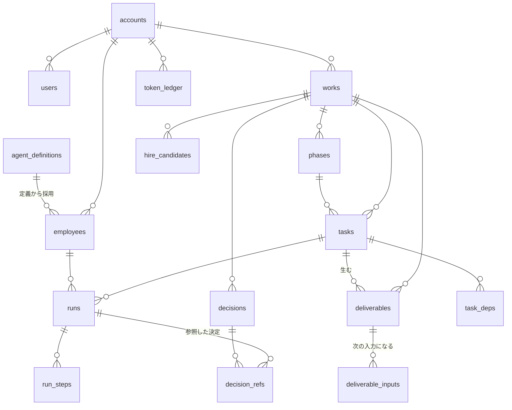

# 01 — データモデル

前提: PostgreSQL（Supabase）。すべてのテーブルに `account_id` を持たせ、行レベルセキュリティ（RLS）で会社をまたげないようにする。

## 全体図



## テーブル

### 会社とユーザー

| テーブル | 主な列 | 備考 |
|---|---|---|
| `accounts` | `id, name, plan, token_balance, token_rate, created_at` | 1社＝1テナント |
| `users` | `id, account_id, email, display_name, role, created_at` | MVP は `role='founder'` のみ |

### Work（仕事のまとまり）

| 列 | 型 | 意味 |
|---|---|---|
| `id` | uuid | |
| `account_id` | uuid | |
| `title` | text | 「日本語学習サービス」 |
| `goal` | text | **自由文**。業種を列挙しない |
| `status` | text | `draft / planning / plan_review / active / paused / done / archived` |
| `current_phase_id` | uuid | null 可 |
| `budget_tokens` | int | この Work に使ってよい上限。null なら会社の残高まで |
| `origin_phase_id` | uuid | 昇格して切り出された元のフェーズ（→ [06](./06-work-and-scope.md)） |
| `created_at, started_at, done_at` | timestamptz | |

`phases`: `id, work_id, seq, name, goal, status, planned_tokens, promoted_to_work_id, started_at, done_at`
**フェーズ数は Work ごとに可変**。画面の「フェーズ 2 / 4」はこのレコード数から出す。

### タスク

| 列 | 型 | 意味 |
|---|---|---|
| `id, account_id` | uuid | |
| `work_id` | uuid | **NOT NULL**。すべてのタスクは Work に属する（→ [06](./06-work-and-scope.md)） |
| `phase_id` | uuid | nullable。Work 直下のタスクを許す |
| `title` | text | |
| `intent` | text | 統括AIが社員に渡す依頼文（画面には出さない） |
| `status` | text | `queued / running / needs_decision / blocked / done / failed / cancelled` |
| `assignee_type` | text | `employee` / `user` |
| `assignee_employee_id` | uuid | `assignee_type='employee'` のとき |
| `progress` | int | 0–100。**導出値**。書き込むのはバックエンドだけ |
| `progress_basis` | text | `steps / checklist / binary / manual`。計算式を後から差し替えるための逃げ道 |
| `due_at` | timestamptz | |
| `created_by` | text | `executive` / `user` |

`task_deps`: `task_id, depends_on_task_id` — 受け渡しの順序。ホームのワークフロー図はここから描く。

### AI社員

| テーブル | 役割 |
|---|---|
| `agent_definitions` | **カタログ**。agency-agents 由来の定義（→ [03](./03-agent-schema.md)）。会社に依らない |
| `employees` | **採用したインスタンス**。`account_id, definition_id, display_name, color_token, status, definition_version, memory_store_id, hired_at` |
| `employee_settings` | **社長が編集した分だけ**を持つ。`employee_id, rules[], model_policy, model_fixed, effort_policy, task_token_cap, updated_at` |
| `agent_skills` | **SKILL.md 1枚 = 1行**。`employee_id(null=会社共通), filename, name, description, body, source(builtin/user), enabled` （→ [03](./03-agent-schema.md)） |

`employees.definition_version` は採用時のカタログ版。定義を更新すると版が上がるが、
**走っている実行は採用時の版に固定**される（途中で人格が変わらない）。

`employee_settings` は**差分だけ**を持つ。空なら定義そのまま。
実効値は `定義 → 会社の既定 → 社員ごとの上書き` の3層を重ねて決める（→ [03](./03-agent-schema.md)）。
会社の既定は `accounts.defaults`（`model_policy / effort_policy / task_token_cap`）に置く。

### 実行の記録

| テーブル | 役割 |
|---|---|
| `runs` | 1タスク1回の実行。`task_id, employee_id, status, started_at, ended_at, cost_cents, tokens, resume_cursor, error` — `resume_cursor` は関数が時間切れで抜けたときの再開位置 |
| `run_steps` | `run_id, seq, kind(message/tool_use/tool_result/handoff), tool_name, summary, tokens_in, tokens_out, created_at` |

`run_steps` が**進捗率の根拠**。ホームの粒子アニメーションもこのストリームを購読して動かす。

### 成果物

| 列 | 意味 |
|---|---|
| `id, account_id, work_id, task_id` | |
| `title, kind` | `kind` は `doc / table / chart / link / file`。文字列なので後から増やせる |
| `version` | 1, 2, 3… 同じ `lineage_id` を共有 |
| `status` | `draft / review / approved / rejected / superseded` |
| `storage_path` | Supabase Storage のキー |
| `produced_by_employee_id` | |

`deliverable_inputs`: `deliverable_id, task_id` — **どの成果物がどのタスクの入力になったか**。
これが「社員から社員への受け渡し」の実体で、ホームのフロー図の線はこの表から引く。

### 決定事項

| 列 | 意味 |
|---|---|
| `id, account_id, work_id, task_id` | |
| `question` | 「価格モデルをどれにするか」 |
| `options` | jsonb: `[{key, label, value, pros, cons, recommended, proposed_by}]` |
| `chosen_option_key` | 決まるまで null |
| `rationale` | 決めた理由（任意） |
| `status` | `open / decided / superseded` |
| `supersedes_id` | 決め直したとき、前のレコードを指す |

**追記のみ。書き換えない。** 決め直しは新レコード＋`supersedes_id`。台帳画面はこの履歴をそのまま出す。

`decision_refs`: `decision_id, run_id` — **どの実行がどの決定を読んだか**。
「決めた内容は以降のAI社員が必ず参照する」を、口約束ではなく記録で担保する。

### 入口 — まだ決まっていない人と、すでに事業がある人

原文の Case B（やりたいことが決まっていない）と Case D（すでに事業がある）を受ける。
**ここが無いと、いまの設計は Case A（ゼロから新規事業）にしか答えられない。**

| テーブル | 役割 |
|---|---|
| `discovery_sessions` | 探索の1回。`account_id, status(collecting/proposed/adopted/abandoned), constraints, created_at` |
| `discovery_candidates` | 出した候補。`session_id, name, summary, fit, recommended, adopted_work_id` |
| `business_profiles` | 既存事業。`account_id, name, url, stage, created_at` |
| `imported_sources` | 取り込んだもの。`business_profile_id, kind(site/doc/sheet/analytics/social), locator, status, summary` |
| `diagnoses` | 診断の1回。`business_profile_id, findings, created_at` |

`constraints` は**構造で持つ**（使える時間 / 使えるお金 / 得意なこと / やりたくないこと / いつまでに）。
自由記述にすると、条件を1つ変えて**候補を出し直す**ことができなくなる。

`fit` も構造（`speed / cost / strength` の3スコア）。
画面では棒グラフで並べる。文章で「相性が良いです」と書かない。

`findings` は `{ kind, severity, title, evidence[], suggested_work }` の配列。
**診断は必ず「次に何をするか」まで持つ。** 問題を並べて終わりにしない。

### チャット — 統括AIとの会話は1か所にまとめる

**会話は Work の中に置かない。** チャットに一本化して、Work は仕事の器だけにする。

| テーブル | 役割 |
|---|---|
| `chat_threads` | 会話の1本。`account_id, title, work_id(null可), created_at, last_message_at` |
| `chat_messages` | `thread_id, role(user/executive), body, refs, created_at` |

理由は3つ。

1. **相談は Work をまたぐ。**「価格どうしよう」は Work の中だけの話ではない。
   Work ごとに会話を切ると、横断の相談を置く場所がなくなる
2. **履歴が1か所にあるほうが探せる。** どの Work で話したかを思い出さないと辿れない、をなくす
3. **Work 画面が仕事の状態に集中できる。** フェーズ・タスク・成果物・決定事項だけになる

`work_id` を持たせれば「この会話は日本語学習サービスの話」と紐づく（任意）。
Work 画面からは「統括AIに相談する」で、その Work に紐づいたスレッドへ飛ぶ。

### 質問 — 統括AIの聞き返し

| 列 | 意味 |
|---|---|
| `id, account_id` | |
| `thread_id` | どのチャットで聞いたか。**質問はそのスレッドの入力欄の真上に出る** |
| `work_id, task_id` | どちらも null 可（Work の外でも聞ける） |
| `body, why` | 質問文と、**なぜ聞いているか**の1行。理由のない質問は出さない |
| `options` | `[{ label, description, recommended }]`。**打鍵させないのが原則** |
| `answer, answered_at` | |
| `promoted_decision_id` | 事業判断だったときだけ `decisions` へ昇格 |

### 質問の出し方（画面の決まりごと）

**会話の途中にカードを挟まない。いちばん下に出して、答えるとそのまま会話が続く。**
参考は Claude の AskUserQuestion（選択肢に説明と番号キー）と Gemini（会話の流れの中に出す）、
Mindtrip / ChatGPT（リストの下にスキップ）。

| | |
|---|---|
| 選択肢 | **1行の説明を必ずつける。**「¥1,980」だけでは選べない |
| 推奨 | **印をつけ、いちばん上に置く。** 迷わせない |
| 最後の行 | **自由入力。** 用意した選択肢が外れていても進める |
| 下 | **スキップ。** 数字キーでも選べる |
| 右上 | **N / M。** 複数あるときは順に1つずつ聞く |

`options` は `[{ label, description, recommended }]` の配列で持つ。
`label` だけの配列にしない — 説明が入らなくなる。

**質問は決定ではない。** 答えても決定事項の台帳には出さない
（出すと台帳が「聞かれたこと」で埋まって、本当の判断が埋もれる）。
事業判断だと分かったときだけ、統括AIが `decisions` に昇格させる。

### 採用・通知・トークン・監査

| テーブル | 役割 |
|---|---|
| `hire_candidates` | `work_id, definition_id, reason, expected_tasks, estimated_credits, status(proposed/hired/declined)` |
| `notifications` | `kind, subject_type, subject_id, body, read_at` |
| `token_ledger` | `delta_tokens, reason(grant/consume/refund), work_id, run_id, balance_after` — **残高は台帳の合計から導出**。列を直接更新しない。内部は**セント単位の整数**で持ち、表示のときだけ `token_rate`（既定 1トークン = $0.00001）でトークンに直す |
| `audit_events` | `actor(user/executive/employee), verb, subject_type, subject_id, payload, created_at` — すべての状態遷移を残す |

## 不変条件

1. **進捗はどこからも直接書かれない。** `progress` は `run_steps` か `checklist` から導出した値だけを入れる。時間経過で進めない
2. **`token_balance` は `token_ledger` の合計と一致する。** ずれたら台帳が正
3. **`decisions` は UPDATE しない。** 状態遷移（open→decided）以外の書き換えは禁止
4. **タスクは `needs_decision` のあいだ、絶対に自動で先へ進まない**
5. **すべての状態遷移は `audit_events` に1行残る。** 画面に出ている状態は必ず根拠を辿れる
6. 業種・職種・フェーズ名を**コードに埋め込まない**
7. **すべてのタスクは Work に属する**（`tasks.work_id` NOT NULL。用事は廃止 → [06](./06-work-and-scope.md)）
8. **Work は入れ子にしない。** 階層は Work → フェーズ → タスク の3段で固定
9. **候補は消さない。** `discovery_candidates` は採用しなかったものも残す。
   「なぜその道を選んだか」は、選ばなかった道と並べて初めて意味になる
10. **質問は決定事項の台帳に出さない。** 昇格したものだけが `decisions` に載る

## 進捗率の出し方

```
progress_basis = 'steps'     → 完了した run_steps / 見積もりステップ数（上限95%。完了時のみ100）
progress_basis = 'checklist' → 完了したチェック項目 / 全項目
progress_basis = 'binary'    → 0 か 100
progress_basis = 'manual'    → 人が入れた値（例外用）
```

`needs_decision` のタスクは**作業自体は終わっている**ので 90–95% で止め、判断後に 100 にする。
画面（タスク表・ホームのリング）はこの値をそのまま表示する。**画面側で盛らない。**
