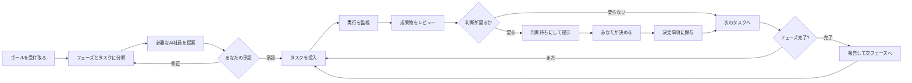

# 02 — 統括AIの実行モデル

統括AI（Executive）は**社員ではない**。仕事をしない。分解し、編成し、依頼し、見張り、あなたに判断を求める。

## ループ



## いつ動くか（起動トリガ）

統括AIは常時走らせない。以下のときだけ起きる。

| トリガ | やること |
|---|---|
| あなたが話しかけた | 応答。**新しい依頼なら、用事 / フェーズ / Work のどれかに先に振り分ける**（→ [06](./06-work-and-scope.md)）。用事なら計画も承認もなく、適任の社員に振って即実行 |
| タスクが `done` になった | 成果物をレビューし、後続タスクを起こす |
| タスクが `failed` になった | 原因を読み、1回だけ組み直す。だめなら `blocked` にしてあなたに出す |
| 決定が `decided` になった | 待っていたタスクを解放する |
| 成果物が承認された | 次フェーズの判定 |
| 定期（1日1回） | 停滞の検知と、朝の報告 |

**ポーリングしない。** イベント駆動（DBのイベント → キュー → 統括AIの1ターン）。

## 社員への依頼に必ず入れる4点

タスクを社員に渡すとき、依頼の中身は**毎回この構造**で組む。ここがブレると出力がブレる。

```
1. Workのゴール           works.goal（原文のまま）
2. 承認済みの決定事項      decisions where status='decided' の一覧（構造化）
3. 上流の成果物           deliverable_inputs で紐づいたもの（本文または要約）
4. あなたの役割           agent_definitions.body（Identity / Mission / Rules）＋ memory store
   ＋ 今回の依頼          tasks.intent と、期待する成果物の形
```

`decision_refs` に「この実行がどの決定を読んだか」を記録する。
**「決めたことが無視された」を後から検証できる状態にしておく**のが目的。

## プロンプトの並べ方（キャッシュのため）

Claude のプロンプトキャッシュは**前方一致**で効く。1バイトでも前が変われば後ろは全部無効になる。
だから安定したものを先に、揺れるものを後ろに置く。

```
[ 安定 ] 統括AIの憲法（プロダクト定義・禁止事項・出力形式）   ← ほぼ不変
[ 安定 ] 役割定義（そのAI社員の Identity / Mission / Rules）  ← 版が上がるまで不変
[ 半安定] Workのゴール＋承認済み決定事項                      ← 決定が増えたときだけ変わる
─────────── ここまでをキャッシュ ───────────
[ 揮発 ] 上流の成果物・今回の依頼・現在時刻
```

キャッシュ読みは通常入力の約 0.1 倍、書き込みは 1.25 倍（5分TTL）。
同じ Work で連続してタスクを回す使い方なので、**入力コストの実効値は 2〜3 割まで落とせる**見込み。

## どこで止まるか（人間ゲート）

自動で越えてはいけない線。ここを越えないことが、この製品の信用そのもの。

| ゲート | 止まる理由 |
|---|---|
| **計画の承認** | 誰を雇い、いくら使うかを決めるのは社長 |
| **判断待ち** | 選択肢のトレードオフが事業判断になるとき |
| **成果物の承認** | 外に出るもの・次の前提になるもの |
| **トークン上限** | Work 予算 / 会社残高に達したら停止（→ [05](./05-tech-and-cost.md)） |
| **外部への副作用** | 送信・公開・課金・削除は、必ず事前に確認 |

止まったときは**必ず理由と選択肢を出す**。「エラーが出ました」で終わらせない。

## 失敗の扱い

```
1回目の失敗 → 統括AIが原因を読み、依頼を組み直して1回だけ再実行
2回目の失敗 → タスクを blocked にし、「何が起きたか／何を変えれば進むか」を提示して あなた待ち
```

**勝手に別の道へ進まない。** 迂回は提案としてだけ出す。

## モデルと思考量の割り当て（ユーザーには見せない）

| 用途 | 階層 | 既定 | 理由 |
|---|---|---|---|
| 統括AIの計画づくり・最終判断 | `deep` | Claude Opus 5 | 判断の質が全体を決める |
| **成果物を作る工程** | `standard` | Claude Sonnet 5 | ここが製品そのもの。安くしすぎない |
| 読む・集める・要約・分類 | `fast` | Claude Haiku 4.5 | 入力が多く推論が浅い。ここを安くする |

抽象名（`deep / standard / fast`）でコードを書き、実モデルは設定表に置きます。調達は Anthropic に直接（→ [05](./05-tech-and-cost.md)）。
画面には出しません。「詳細」の奥にだけ上書きトグルを置きます。

### 1タスクを2工程に割る

読む工程は入力が多く推論が浅い。作る工程は入力が少なく推論が深い。**同じモデルで両方やるのが一番もったいない。**

```
[ 集める ] fast     … Web検索・上流成果物の読み込み → 要点だけ返す
      ↓ 要点（数千トークン）
[ 作る   ] standard … 決定事項と要点から成果物を書く
```

統括AIの監視も同じ考え方で、15回のうち12回は `fast` に落とし、計画と最終判断だけ `deep` に残します。
これで 1 Work の原価が $6.00 → $3.82 まで下がります。ループは SDK の Tool Runner が回し、Web検索・Webフェッチ・コード実行はサーバー側ツールを使います。

## 統括AIのプロンプトは DB に置く

`system_prompts` テーブル（`key, version, body, activated_at`）に持ち、デプロイなしで差し替え・巻き戻しができるようにする。
プロンプトは**一番よく変わるもの**なので、コードに書かない。
