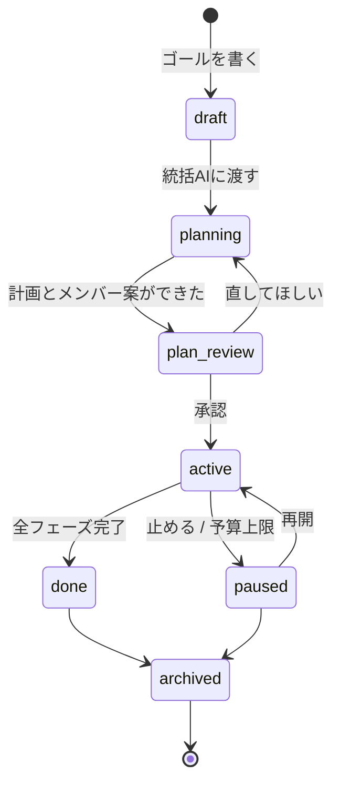
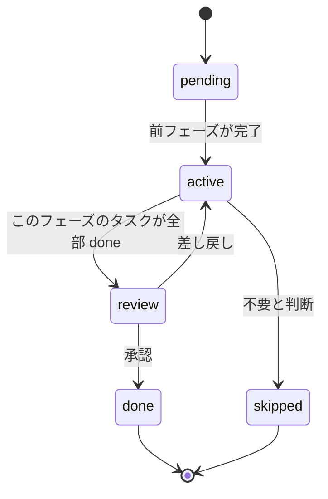
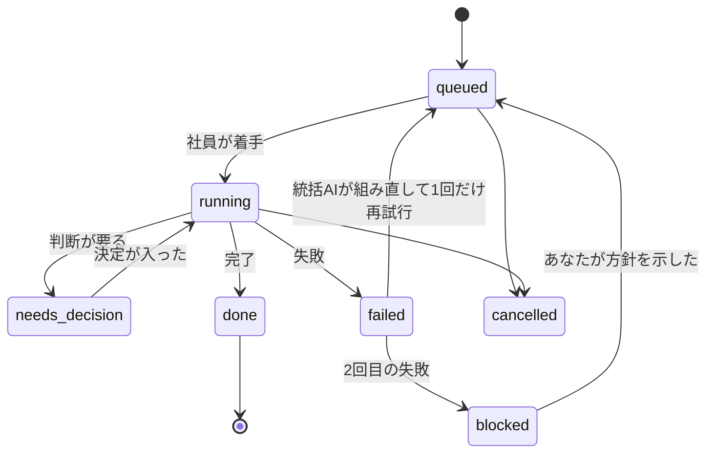
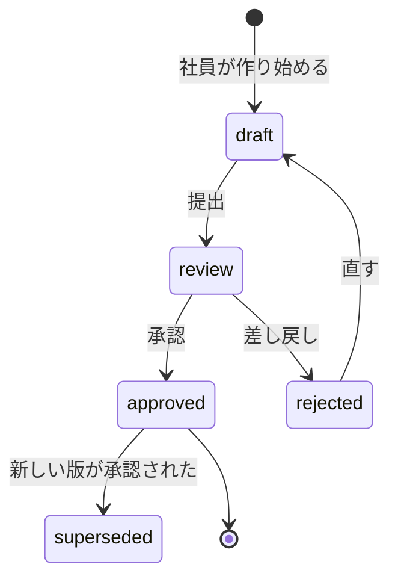
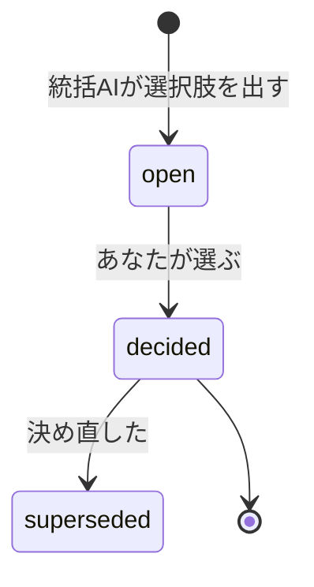
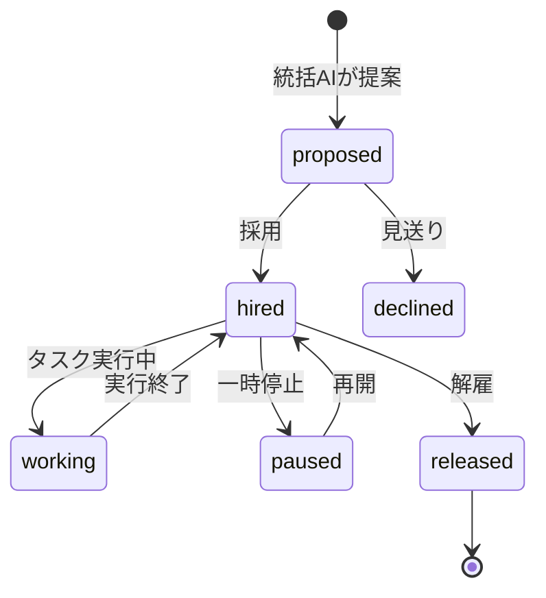
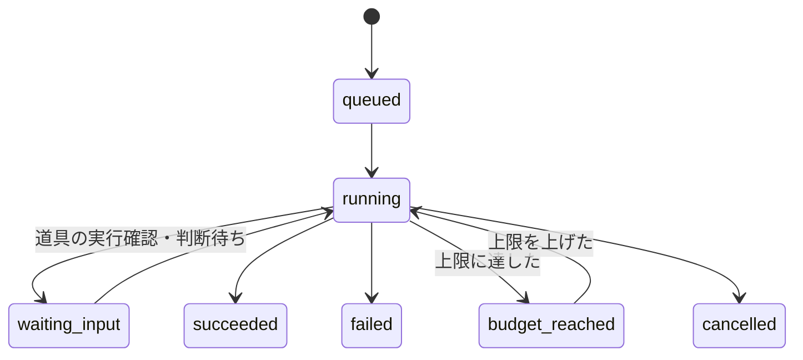

# 04 — 状態遷移

**画面の状態＝バックエンドの状態。** ここに書いていない状態は画面に出さない。
色は Phase 1 のデザイン言語に従う（青＝次に押すもの / 緑＝済・推奨 / 橙＝判断待ち / 赤＝停止）。

## Work

| 状態 | 画面 |
|---|---|
| `draft` | 下書き。灰 |
| `planning` | 統括AIが考え中。粒子アニメーション |
| `plan_review` | **橙**。ホームでも判断待ちに出る |
| `active` | 緑のドット（稼働中） |
| `paused` | 灰。理由を必ず添える |
| `done` | 緑 |

## フェーズ

## タスク

| 状態 | 表示 | 色帯（行の左3px） | 進捗 |
|---|---|---|---|
| `queued` | 待機 | `#2E2E2E` | — |
| `running` | 実行中 | 担当社員の色 | 実値 |
| `needs_decision` | 判断待ち | **橙** | 90〜95%で停止 |
| `blocked` | 停止 | **赤** | 現在値のまま |
| `done` | 完了 | 緑 | 100% |
| `failed` | （画面には出さず、再試行か blocked に遷移） | — | — |
| `cancelled` | 取消 | 灰・打ち消し | — |

**`needs_decision` からは、決定なしに絶対 `done` へ行かない。**

## 成果物

- 版は `version` を上げ、`lineage_id` で束ねる。**上書きしない**
- `approved` になって初めて、後続タスクの入力（`deliverable_inputs`）になれる
- 差し戻し理由は必ず残す（監査と、社員の学習の両方に効く）

## 決定事項

- `decided` になった瞬間に、それを待っていたタスクが `queued` に戻る
- 決め直しは**新レコード**。前のものは `superseded` として台帳に残す
- 以降の全実行はこの決定を読む。読んだ記録は `decision_refs` に残る

## AI社員（employees）

ホームの「稼働中 2 / 3」は `working` の数 / `hired` の数。

## 実行（runs）

`budget_reached` は**終了ではない**。実行の状態は run_steps に残ったまま止まる。
上限を上げれば続きから走る。画面には「トークン上限で停止中」と、増額ボタンを出す。

## 不変条件（再掲・実装時のチェックリスト）

- [ ] `needs_decision` のタスクは、対応する `decisions.status='decided'` なしに `done` へ遷移しない
- [ ] `approved` でない成果物は `deliverable_inputs` に入れられない
- [ ] `decisions` は UPDATE されない（状態遷移列を除く）
- [ ] すべての遷移が `audit_events` に1行残る
- [ ] `progress` はバックエンドの導出値だけが書き込む
- [ ] `credit_balance` は `credit_ledger` の合計と一致する
