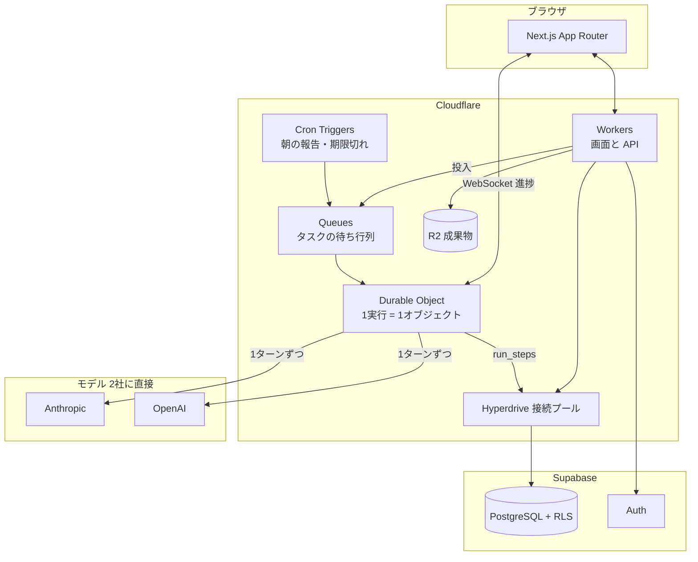

# 05 — 技術構成とコスト

> 2026-08-21 第3改訂。ホスティングを **Cloudflare** に確定。
> モデルは **Anthropic と OpenAI の2社に直接**。仲介と Managed Agents は使いません。

## 結論

| | 採用 | 見送り（後から足せる） |
|---|---|---|
| ホスティング・実行 | **Cloudflare**（Workers / Durable Objects / Queues / Cron / R2） | Vercel |
| DB・認証 | **Supabase**（Postgres ＋ RLS ＋ Auth） | Neon など |
| 成果物の保管 | **R2**（下り転送が無料） | Supabase Storage |
| モデル | **Anthropic 直 ＋ OpenAI 直**（2社を直接） | OpenRouter などの仲介 |
| エージェント実行 | **Messages API ＋ Tool Runner**（自前の1ループ） | Managed Agents |
| 道具 | **サーバー側ツール**（Web検索・Webフェッチ・コード実行） | 自前サンドボックス |

**3つとも「後から足せるもの」でした。だから最初は足しません。**

## 構成



## Cloudflare を採る

**採用します。** 決め手は値段ではなく、**実行の形が素直になる**ことです。

### 1実行 = 1 Durable Object

AI社員が1タスクをこなす間、状態を持つ場所が要ります。Durable Object はそれにそのまま使えます。

| DO がくれるもの | なぜ効くか |
|---|---|
| **1実行につき1つ、確実に1つだけ** | 二重起動が起きない。キューが同じジョブを2回配っても、掴むのは同じオブジェクト |
| **状態をメモリに持てる** | 会話履歴を毎ターン DB から読み直さなくていい |
| **WebSocket をそのまま張れる** | 進捗を画面へ直接押し出せる。DB を経由しない |
| **alarm で自分を起こせる** | 待ちが必要なとき（レート制限・再試行）にタイマーを持てる |

進捗の画面反映は **DO からの WebSocket** に寄せます。Supabase Realtime は使いません。
（`run_steps` は監査と再開のために DB へ書き続けます。画面への配信経路が変わるだけです。）

### 待っている時間が安い

Workers の課金は **CPU 時間**です。エージェントの実行は、ほとんどの時間が**モデルの応答待ち**で、
その間 CPU は動いていません。**この用途では有利な課金の形**です。

Durable Object は稼働時間（GB秒）でも課金されますが、含まれる **400,000 GB秒** は
1オブジェクト 128MB として **約 3,200,000 秒**。1 Work（13タスク × 約12分）で約 1,170 GB秒なので、
**含まれるぶんだけで月 300 Work 以上**。この規模では実質定額です。

| | |
|---|---|
| Workers 有料プラン | **$5/月**（1,000万リクエスト・3,000万 CPUミリ秒込み） |
| 超過 | 100万リクエスト $0.30 / 100万 CPUミリ秒 $0.02 |
| Durable Objects | 100万リクエスト・400,000 GB秒 が同じ $5 に含まれる |
| R2 | 成果物の保管。**下り転送が無料** |

### それでも「1ターンずつ書いて再開できる」形は崩さない

プラットフォームの実行時間の上限がいくつであっても困らないように、実行はこう組みます。

```
1. Queue がジョブを配る → Durable Object が掴む
2. Tool Runner を1ターン回すたびに run_steps を1件書く
3. 上限が近づいたら、そこで正常終了する（状態は run_steps に全部ある）
4. alarm か次のジョブが、run_steps の続きから再開する
```

**進捗を run_steps に書く設計はもともと必要でした**（画面表示と監査のため）。
それがそのまま「途中で切れても再開できる」をくれます。
この形にしておけば、**あとで Vercel に戻っても、実行の中身は変わりません。**

### 正直な注意点

1. **Next.js を Workers で動かすには OpenNext アダプタが要る。** 動きますが、ビルド手順が1枚増えます
2. **Node 互換の確認を最初にやる。** 使う SDK（Anthropic / OpenAI / AI SDK）はいずれも fetch ベースなので
   Workers で動く見込みは高いですが、**Phase 3 の 0番目のタスク**として先に確かめます
3. **Postgres は残します。** 多テナントの安全は行レベルセキュリティ（RLS）に賭けているので D1 には替えません。
   Workers から Postgres は **Hyperdrive** 経由で接続プールを解決します
4. **Supabase の役割が減ります。** Storage は R2 に、Realtime は DO の WebSocket に移るので、
   残るのは **Postgres ＋ Auth** です。将来もっと安い Postgres に替える余地が生まれます

固定費は **Workers $5 ＋ Supabase Pro $25 = $30/月**。

## モデルは2社に直接つなぐ

**Anthropic と OpenAI の両方に、直接つなぎます。OpenRouter などの仲介は挟みません。**

### なぜ仲介を挟まないか

OpenRouter 自体は良くできています（推論に上乗せなし、キャッシュも透過する）。
それでも挟まないのは、OneFound が**モデルの品揃えを必要としない**からです。使う階層は3つだけです。

| | 直接 | 仲介あり |
|---|---|---|
| プロンプトキャッシュ | 仕様どおり。**原価の見積もりが読める** | 透過するが間に1枚入る。外れたときの切り分けが増える |
| 手数料 | なし | クレジット購入時 5.5% |
| Batch / Flex（夜間の一括処理を割引） | 使える | 使えない |
| サーバー側ツール（Web検索・コード実行） | 使える | 一部制限 |
| データの学習利用 | 2社とも API は既定で不使用 | プロバイダごとに違う。設定で塞ぐ必要がある |
| 障害時の迂回 | **2社あるので自分で切り替えられる** | 自動 |

仲介の一番の利点は「障害時の自動迂回」でしたが、**2社に直接つないだ時点で、そこは自前で足ります。**

### 単価（100万トークンあたり）

| 階層 | 使う所 | Anthropic | OpenAI |
|---|---|---|---|
| `deep` | 統括AIの計画・最終判断 | **Opus 5** $5.00 / $25.00 | GPT-5.6 Sol $5.00 / $30.00 |
| `standard` | **成果物を作る工程** | **Sonnet 5** $3.00 / $15.00 | GPT-5.6 Terra $2.50 / $15.00 |
| `fast` | 読む・集める・要約・分類 | **Haiku 4.5** $1.00 / $5.00 | GPT-5.6 Luna $1.00 / $6.00 |

太字が現時点の既定です。**見ての通り、2社はほぼ同じ値段です。**

だから **OpenAI を足す理由は「安くするため」ではありません。** 3つあります。

1. **止まらないため。** 片方が落ちても、もう片方に切り替えて実行を続けられる
2. **選べるため。** 階層ごとに、実測して得意な方を当てる（今は分からないので、実測してから決める）
3. **夜間の割引。** 週次まとめのような急がない処理は Batch / Flex に流す

### プロンプトキャッシュは2社で作法が違う

| | Anthropic | OpenAI |
|---|---|---|
| 指定の仕方 | **明示的**にキャッシュ位置を置く | **自動**（同じ前置きなら勝手に効く） |
| 割引 | キャッシュ読みは通常入力の約 0.1 倍 | キャッシュ入力は通常の約 0.1 倍 |
| 効かせ方 | **どちらも「安定した前置きを先、揺れるものを後ろ」** | 同左 |

**プロンプトの並べ方（→ [02](./02-executive-model.md)）は両方に効きます。** 設計を変える必要はありません。

### `ModelProvider` を1枚挟む

```
AgentRunner
  └─ ModelProvider          ← ここで2社を吸収する
       ├─ AnthropicProvider  … キャッシュ位置を明示、サーバー側ツールあり
       └─ OpenAIProvider     … キャッシュは自動、道具の名前が違う
```

プロバイダごとに違うのは「キャッシュの指定」と「使える道具」だけです。
道具は `capabilities` で吸収します（[03](./03-agent-schema.md) のAI社員定義と同じ仕組み）。

**切り替えは設定値。** 階層ごとにどちらを使うかを表で持ち、コードは階層名しか知りません。

### 安いモデルは、順番を逆にしない

さらに安いモデルに寄せると 1 Work は $3.82 → $2.78 程度まで下がります。**差は約 $1（¥150）。**
Pro プランで月 ¥750〜1,050、粗利率にして5ポイントぶんです。実在しますが、初日に取りに行く額ではありません。

1. Phase 3 の最後に、**同じタスクを両社・複数階層で走らせて、成果物を並べて比べる**
2. 質が落ちないと確認できた階層だけ、安い方に寄せる

**先に安くして、あとで質を確かめる順番にはしません。逆にします。**

## Managed Agents をやめる理由

Anthropic 直に戻したので、Managed Agents はまた選べます。それでも使いません。
**必要な機能が、素の Messages API と自前の設計でほぼ埋まっている**からです。

| Managed Agents がくれるもの | OneFound での代わり |
|---|---|
| エージェントのループ | SDK の **Tool Runner** がループを回す。書くのはツールの中身だけ |
| サンドボックス（コード実行・Web検索） | **サーバー側ツール**として素のAPIで使える |
| 社員の記憶 | `employees` と Postgres に持つ。**自分のDBにある方が、画面に出すのも消すのも楽** |
| 委譲・並列 | 統括AIのタスクグラフがそれ。**受け渡しの可視化が製品そのもの**なので、外に出したくない |
| セッションの予算上限 | 応答に含まれる使用量から自分で計測する |
| 定期実行 | Cloudflare Cron Triggers |
| 設定の版管理 | `agent_definitions` に版を持つ（[03](./03-agent-schema.md)） |

残るのは「beta の仕様変更に振り回されない」という利点だけです。
`AgentRunner` の実装をもう1つ足せばいつでも戻れるので、**必要になってから戻します。**

## 1 Work あたりの原価

前提: 4フェーズ / 13タスク / AI社員3体、$1 = ¥150、プロンプトキャッシュ込み。

| 内訳 | | 金額 |
|---|---|---|
| AI社員 1タスク | 集める(fast) → 作る(standard) の2工程 | $0.23 |
| × 13タスク | | $2.99 |
| 統括AI | 計画1回(deep) ＋ 監視15回(うち12回 fast) | $0.83 |
| **1 Work 合計** | **≈ ¥573** | **$3.82** |

| 使い方 | API原価 |
|---|---|
| 月3 Work | $11（¥1,700） |
| 月5 Work | $19（¥2,900） |
| 月10 Work | $38（¥5,700） |

固定費: Workers $5 ＋ Supabase Pro $25 = **$30/月**（顧客数で割る）

## トークンの定義

呼び方を「クレジット」から **「トークン」** に変えます。

> **1トークン = $0.00001**（10万トークンで $1）

| | トークン |
|---|---|
| AI社員 1タスク | 約 **20,000** |
| 1 Work（13タスク＋統括AI） | 約 **350,000** |
| Pro プランの月枠 | **2,000,000** |

画面の表示は `412,000 / 2,000,000`。

**正直に書いておくこと**: これはモデルの実トークン数ではありません。
使うモデルによって1トークンの重みが違うので、**原価を揃えた OneFound 共通の単位**です。
画面には「1トークン ≒ AIの処理の最小単位。実際の消費はモデルによって変わります」と一言添えます。

内部は**セント単位の整数**で持ち、表示のときだけ `token_rate` で直します。浮動小数を通しません。

| 上限をかける場所 | |
|---|---|
| 会社の月枠 | `accounts.token_balance`。0 で新規実行を止める |
| Work ごと | `works.budget_tokens` |
| 1実行ごと | Durable Object が使用量を積算し、超えたら一時停止（再開可） |
| 用事1件ごと | 30,000トークン。超えそうなら Work への昇格を提案（→ [06](./06-work-and-scope.md)） |

## 無料枠をどうするか

**「Free プラン」は作りません。代わりに「7日トライアル」＋「閲覧だけは永久に無料」にします。**

```
登録（カード不要）
  → 7日間 / 200,000トークン
     （最初のフェーズを完走して、成果物を1つ受け取れる量）
  → 期限切れ or 使い切り
  → 「閲覧のみ」に自動で落ちる（永久・無料）
     作ったものは全部見られる。新しい実行だけ止まる
```

> **なぜ「1 Work 完走」ではなく「最初のフェーズ」なのか。**
> Work は4フェーズで10週かかる想定なので、7日では終わりません。
> トライアルで見せるべきは全体の完成ではなく、**「AI社員が実際に働いて、成果物が出てくる」瞬間**です。
> 調査フェーズ1つ（約80,000トークン）＋統括AI で足ります。200,000 は余裕を見た数字です。

### なぜ「Free プラン」にしないか

1. **この製品は原価が変動費です。** 普通のSaaSの無料枠は限界費用がほぼゼロですが、
   OneFound は無料ユーザー1人あたり毎月 $2〜4 が出続けます。居座られると効きます
2. **成果物が出るところまで見せないと価値が伝わりません。** 途中で切れると
   「AIが微妙だった」という印象だけ残って離脱します。**絞るより、一番良い体験を1回**
3. **期限があると人は決めます。** 無期限の無料枠は、判断を先延ばしにさせるだけです。
   7日は短いようですが、**最初の成果物は初日か2日目に出ます**。迷う時間としては十分です

### なぜ「閲覧のみ」を永久に無料で残すか

- **原価がゼロ**（実行しないので）。ストレージ代だけ
- 作った成果物と決定事項が消えないので、**戻ってくる理由が残る**
- 「無料プランがある」と言える（実態は違いますが、嘘でもない）

不正対策: メール確認必須、1アカウント1回、同一決済手段での再取得を弾く。

## 料金プラン

年払いは月換算で 22〜25% 引き。

| プラン | 月払い | 年払い（月換算） | トークン / 月 | API原価 | Work の目安 |
|---|---|---|---|---|---|
| **トライアル** | ¥0 | — | 200,000 / 7日 | $2 | 最初のフェーズ |
| **閲覧のみ** | ¥0 | ¥0 | — | $0 | 実行できない |
| **Starter** | ¥3,980 | **¥2,980** | **800,000** | $8 | 月 2本 |
| **Pro** ⭐ | ¥8,980 | **¥6,980** | **2,000,000** | $20 | 月 5本 |
| **Business** | ¥19,800 | **¥14,800** | **4,000,000** | $40 | 月 10本 |

粗利（API原価のみ・固定費別）:

| | 月払い | 年払い |
|---|---|---|
| Starter | 70% | 60% |
| Pro | 67% | 57% |
| Business | 70% | 59% |

固定費 $30/月は **Starter 2社で回収**できます。

### プラン間の差

**トークンだけで差をつけません。** トークンだけだと「安いプランで足りる」に流れ、
足りなくなったら追加購入するだけになります。**追加購入は全プランで開けたまま**にして、
上のプランに行く理由は別に置きます。

| | 閲覧のみ | Starter | Pro ⭐ | Business |
|---|---|---|---|---|
| **トークン / 月** | — | 800,000 | 2,000,000 | 4,000,000 |
| **同時に進行できる Work** | — | **2** | **5** | 無制限 |
| **採用できるAI社員** | — | **3** | **10** | 無制限 |
| **AI社員を自分で作る** | — | — | ○ | ○ |
| **外部連携**（Slack / Notion / Drive） | — | — | ○ | ○ |
| **閲覧メンバーの招待** | — | — | 3人 | 10人 |
| 成果物・決定事項の閲覧 | ○ | ○ | ○ | ○ |
| 混雑時の優先実行 | — | — | — | ○ |
| サポート | — | メール | 優先メール | 個別 |

差の付け方の考え方:

- **成果物の質でプランを分けない。** 安いプランに弱いモデルを当てると、
  一番口コミが要る層の体験が落ちます。**全プラン同じ品質**にします
- **同時Work数**が一番効く軸です。事業を2本持ったら Pro、というのが自然な線
- **AI社員を自分で作れる**を Pro 以上にします。ここが「AIカンパニーを自分で設計する」の入口で、
  この製品の性格そのものなので、有料の芯に置きます
- **保存期間で人質を取らない。** 作ったものは無料に落ちても見られます

追加トークン: **500,000 トークン ¥2,500**（原価 $5・粗利 67%）。全プランで購入可。

## セキュリティ

- **RLS を全テーブルに。** サービスロールキーは実行オブジェクトだけが持つ
- **Anthropic も OpenAI も、API のデータを既定で学習に使いません。** これを利用規約に明記します
- **秘密情報は社員の記憶に書かない。** 保管庫に置き、実行時にだけ注入する
- **成果物は R2 に置き、署名URLで配る。** 公開バケットを作らない
- 監査は `audit_events` と `decision_refs`

## Phase 3（実装）で作る範囲

0. **Workers 上で SDK が動くことの確認**（ここで詰まると全部止まるので最初にやる）
1. スキーマと RLS、認証、レール＋ホームの器
2. Work 作成 → 統括AIが計画 → 承認 の一本道
3. AI社員1体で1タスクを最後まで実行。run_steps を Realtime で画面へ
4. 成果物の保存・レビュー・承認
5. 判断待ち → 決定 → 後続タスク解放
6. トークンの計上と上限、トライアルから「閲覧のみ」への自動降格
7. 社員を3体に増やし、受け渡しをホームのフロー図に出す
8. **モデルの実測。** 同じタスクを両社・複数階層で走らせ、質を見てから寄せる先を決める
