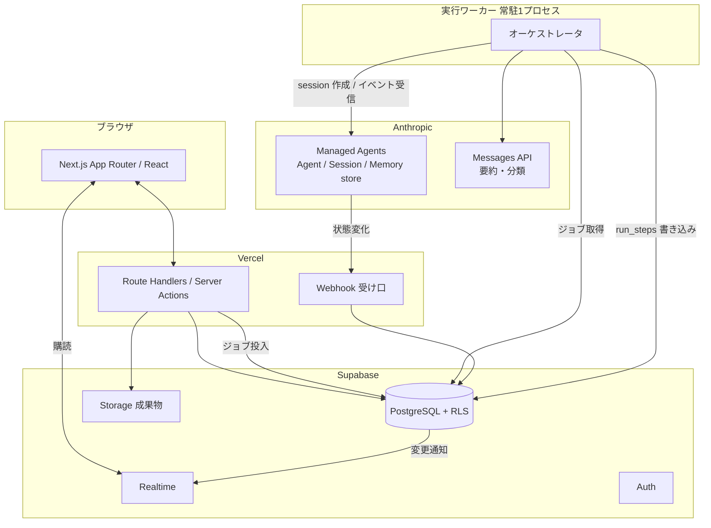

# 05 — 技術構成とコスト

## 構成

## なぜ Managed Agents か

Anthropic の **Managed Agents**（beta）は、OneFound の概念とほぼ1対1で対応する。
自前でエージェントループを書くと、ここを全部自作することになる。

| OneFound の概念 | Managed Agents | 自前で作る場合 |
|---|---|---|
| AI社員の定義 | Agent（**版が付く**。更新しても走行中のセッションは旧版に固定） | 定義の版管理を自作 |
| 社員が1タスクをこなす | Session（コンテナ付き。ファイル操作・コード実行はその中） | ループ＋サンドボックスを自作 |
| 社員の記憶 | Memory store（版つき・監査可能） | 記憶の保存と再注入を自作 |
| 統括AIが社員に委譲 | `multiagent: coordinator` ＋ ロスター（スレッド分離・並列） | 委譲プロトコルを自作 |
| クレジット上限 | Session budget（**上限で一時停止**、上げれば続きから再開） | トークン計測と中断・再開を自作 |
| 定期実行（朝の報告） | Scheduled deployments | cron を自作 |
| 状態変化の通知 | Webhook | ポーリングを自作 |
| 途中経過の表示 | イベントストリーム（SSE） | 自作 |

**判断: Managed Agents を採る。** ただし beta なので、`AgentRunner` というインターフェースを1枚挟み、
中身を「自前ループ（Messages API + Tool Runner）」に差し替えられるようにしておく。

### 比較した選択肢

| 案 | 長所 | 短所 | 判定 |
|---|---|---|---|
| **A. Managed Agents** | ループ・サンドボックス・記憶・予算・定期実行が最初からある | beta。仕様が動く可能性 | **採用**（抽象を1枚挟む） |
| B. Messages API + Tool Runner を自前ホスト | 枯れている。全部制御できる | サンドボックス・記憶・予算・並列委譲を全部自作 | 差し替え先として温存 |
| C. Claude Agent SDK | ファイル操作系の道具が揃っている | コーディング用途寄り。デプロイは自前 | 不採用 |

### ワーカーが要る理由

Managed Agents のイベントは SSE で流れてくる。**画面に「いま何をしているか」を出す**ためにこれを常時受ける必要があり、
サーバーレス関数より常駐プロセスの方が素直。小さい常駐ワーカー1つ（Fly.io / Railway で月 $5〜10）を置く。
状態変化そのものは Webhook でも来るので、ワーカーが落ちても取りこぼさない（再接続時にイベント一覧を取り直して重複排除する）。

## モデルの割り当てと単価

Anthropic 公式 API の一覧価格（100万トークンあたり）。

| 用途 | 階層 | モデルID | 入力 | 出力 |
|---|---|---|---|---|
| 統括AI | `deep` | `claude-opus-5` | $5.00 | $25.00 |
| AI社員 | `standard` | `claude-sonnet-5` | $3.00 | $15.00 |
| 要約・分類・通知文 | `fast` | `claude-haiku-4-5` | $1.00 | $5.00 |

> Sonnet 5 は 2026-08-31 まで導入価格 $2 / $10。**試算は通常価格で置く**（すぐ切れるため）。

コストを下げる仕掛け:
- **プロンプトキャッシュ** — 読みは通常入力の約 0.1 倍、書き込みは 1.25 倍（5分TTL）。並べ方は [02](./02-executive-model.md) の通り
- **思考量（effort）** — 社員の定型作業は低め、統括AIの計画と判断整理は高めに振る
- **Batch API** — 夜間の一括処理（週次まとめ等）は 50% 引き

## 1 Work あたりのコスト試算

前提: 1 Work = 4フェーズ / 13タスク、AI社員3体、$1 = ¥150。

**AI社員 1タスク（Sonnet 5）**

| 内訳 | 計算 | 金額 |
|---|---|---|
| 入力（キャッシュ書き 20k × 1.25） | 20k × $3 × 1.25 / 1M | $0.075 |
| 入力（キャッシュ読み 4回 × 20k） | 80k × $3 × 0.1 / 1M | $0.024 |
| 入力（都度 4k × 5ターン） | 20k × $3 / 1M | $0.060 |
| 出力 8k | 8k × $15 / 1M | $0.120 |
| Web検索 3回 | $10 / 1,000 | $0.030 |
| セッション稼働 12分 | 0.2h × $0.08 | $0.016 |
| **合計** | | **≈ $0.33（¥50）** |

**統括AI（Opus 5）1 Work あたり**

| 内訳 | 金額 |
|---|---|
| 計画づくり 1回（入力30k / 出力12k） | $0.48 |
| 監視・レビュー・判断整理 15回 | $1.28 |
| **合計** | **≈ $1.75（¥263）** |

**1 Work 合計 ≈ $6.0（¥900）** — 13タスク × $0.33 ＋ 統括AI $1.75

| 使い方 | 月間API原価 |
|---|---|
| 月3 Work（想定される標準） | ≈ $18（¥2,700） |
| 月5 Work（よく使う人） | ≈ $30（¥4,500） |
| 月10 Work（ヘビー） | ≈ $60（¥9,000） |

固定費: Vercel Pro $20 ＋ Supabase Pro $25 ＋ ワーカー $10 = **$55/月**（顧客数で割る）

## クレジットの定義

画面の「クレジット 812 / 3,000」に意味を持たせる。

> **1クレジット = 一覧価格ベースの $0.01（1セント）**

- 1タスク ≈ 33クレジット
- 1 Work ≈ 600クレジット
- 3,000クレジット ≈ 月5 Work

Managed Agents の session budget は**セント単位の整数**で指定するので、
クレジットをそのままセントとして渡せる。換算のズレが生まれない。

| 使う場所 | 上限のかけ方 |
|---|---|
| 会社の月間残高 | `accounts.credit_balance`。0 で新規実行を止める |
| Work ごと | `works.budget_credits` |
| 1実行ごと | session budget（上限で一時停止。上げれば続きから） |

`credit_rate` は設定値。原価が変われば書き換える。

## 料金プラン（たたき台・要判断）

| プラン | 月額 | クレジット | 原価（API） | 粗利率 |
|---|---|---|---|---|
| お試し | ¥0 | 300 | $3 | — |
| Solo | ¥9,800 | 3,000 | $30 | 約 54% |
| Solo+ | ¥19,800 | 7,000 | $70 | 約 47% |
| 追加クレジット | ¥3,500 / 1,000 | | $10 | 約 57% |

固定費 $55/月は顧客数で割られるので、**十数社で黒字**。数字は要検証。

## セキュリティ

- **RLS を全テーブルに。** `account_id` で必ず絞る。サービスロールキーはワーカーだけが持つ
- **秘密情報は vault に。** メモリストアに書かない（後続の全セッションに再生されるため消し切れない）
- **外部への副作用は事前確認。** 送信・公開・課金・削除は人間ゲート（→ [02](./02-executive-model.md)）
- **成果物は Storage に置き、署名URLで配る。** 公開バケットを作らない
- **監査**: `audit_events` と `decision_refs` で「誰が何を根拠に何をしたか」を全部辿れる

## Phase 3（実装）で作る範囲の案

1. スキーマと RLS、認証、レール＋ホームの器（データは空でよい）
2. Work 作成 → 統括AIが計画 → 承認 の一本道を通す
3. AI社員1体（市場リサーチャー）で1タスクを最後まで実行、run_steps を画面に流す
4. 成果物の保存・レビュー・承認
5. 判断待ち → 決定 → 後続タスク解放
6. クレジット計上と上限
7. 社員を3体に増やし、受け渡しをホームのフロー図に出す
