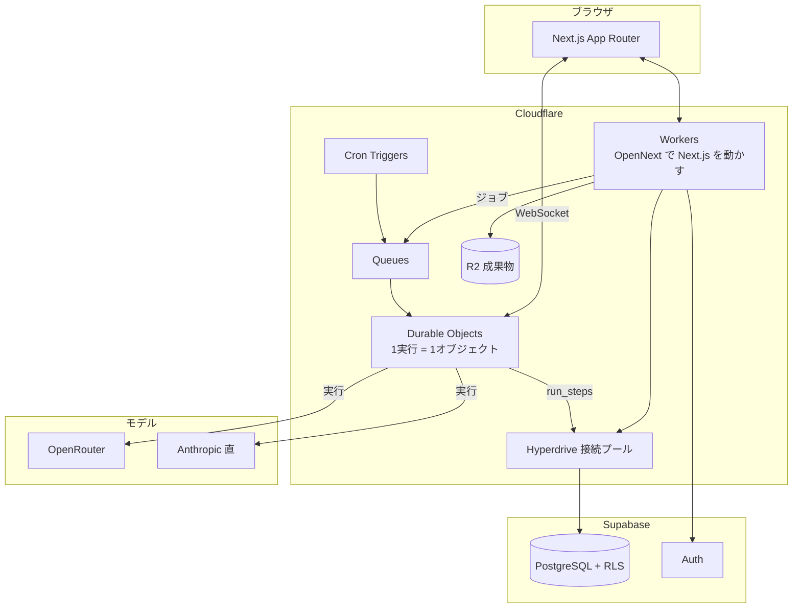

# 05 — 技術構成とコスト

> 2026-08-21 改訂: ホスティングを Cloudflare に、モデル調達を OpenRouter 経由に変更。
> クレジットの刻みを 1/1000 にして、画面に出る数字を大きくした。

## 構成



## なぜ Cloudflare か

**採用します。** 判断の中心は値段ではなく、**Durable Objects が「常駐ワーカー」を消してくれる**ことです。

前の設計では「エージェントの実行イベント（SSE）を受け続けるために常駐プロセスが1つ要る」と書きました。
Cloudflare なら **1実行 = 1 Durable Object** にできます。1つのタスク実行の状態・接続・再接続がそのオブジェクトの中に閉じ、
画面へはそのまま WebSocket で流せます。運用するサーバーが1つ減り、設計も素直になります。

| | 効果 |
|---|---|
| Durable Objects | 実行ごとに独立した状態と接続。常駐ワーカーが不要になる |
| Queues | タスク投入の待ち行列。DB にキューテーブルを作らなくていい |
| Cron Triggers | 朝の報告・停滞検知 |
| R2 | 成果物の保管。**下り転送が無料**なので、ダウンロードが増えても効かない |
| Hyperdrive | Workers から Postgres への接続プール |

料金は **Workers 有料プラン $5/月**（1,000万リクエスト・3,000万 CPUミリ秒込み、超過は 100万リクエスト $0.30 / 100万CPUミリ秒 $0.02）。
Durable Objects は 100万リクエスト・400,000 GB秒 が同じ $5 に含まれ、以降は 100万リクエスト $0.15 ＋ 稼働時間課金。
この規模では**実質定額**です。

### 正直な注意点

1. **Next.js を Workers で動かすには OpenNext アダプタが要る。** 動きますが、Vercel ほど摩擦ゼロではありません。ビルド手順が1枚増え、たまにアダプタ側の対応待ちが出ます
2. **Node 互換は完全ではない。** `nodejs_compat` でかなり埋まりますが、Node 依存の重い SDK は詰まることがあります。Phase 3 の最初に、使う SDK が Workers 上で動くことだけ先に確かめます
3. **Postgres は残します。** 多テナントの安全は行レベルセキュリティ（RLS）に賭けているので、ここは D1（SQLite）に替えません。Supabase の Auth もそのまま使います
4. Realtime は Supabase ではなく **Durable Objects の WebSocket** に寄せます。粒子アニメーションの更新は実行オブジェクトから直接押し出すのが一番短い経路です

固定費は **$55 → $30/月**（Workers $5 ＋ Supabase Pro $25）。常駐ワーカーの $10 と Vercel Pro $20 が消えます。

## なぜ OpenRouter か

**採用します。** 事前に一番心配していた点は潰れました。

| 確かめたこと | 結果 |
|---|---|
| 推論単価に上乗せがあるか | **ない。** プロバイダの単価がそのまま通る |
| 手数料 | クレジット購入時に 5.5%（最低 $0.80）。自前キー（BYOK）は大きな無料枠のあと 5% |
| **プロンプトキャッシュが効くか** | **効く。** Anthropic のキャッシュ読み（約9割引き）は透過する |
| モデルの差し替え | 1本のAPIで切替。フォールバック経路も張れる |

キャッシュが透過するのが決定的でした。OneFound は**同じ前置き（憲法・役割定義・決定事項）を毎タスク送る**設計なので、
ここが効かないと安いモデルに替えても意味がありませんでした。

### 設計上、見落とせない副作用

**Managed Agents は Anthropic 専用です。** OpenRouter 経由のモデルでは使えません。
つまり「AI社員を安いモデルで動かす」と決めた時点で、**社員のループは自前で書く**ことになります。

これは前回入れた `AgentRunner` 抽象がそのまま効きます。実装が2つになるだけです。

| 実装 | 使う場面 |
|---|---|
| `OpenRouterRunner` | **既定。** AI SDK でツール呼び出し・ストリーミング・再試行を回す。Durable Object の中で動く |
| `ManagedAgentRunner` | コード実行やファイル操作のサンドボックスが要る社員が出てきたときだけ |

**判断: Phase 3 は `OpenRouterRunner` 1本で通します。** Managed Agents は温存し、必要になってから足します。

### そのほかの注意点

- **学習利用のポリシーを「拒否」に設定する。** プロバイダによっては送ったデータが学習に使われます。事業のデータを預かる以上、既定で拒否にします
- **安くするほど成果物の質は落ちます。** OneFound の価値は成果物そのものなので、ここは慎重に振ります（下記）

## モデルの階層と割り当て

抽象名（`deep / standard / fast`）でコードを書き、実モデルは設定表で差し替えます。

| 階層 | 何に使うか | 既定 | 単価（入力 / 出力・100万トークン） |
|---|---|---|---|
| `deep` | 統括AIの計画づくり・判断の整理 | Claude Opus 5 | $5.00 / $25.00 |
| `standard` | **成果物を作る工程** | Claude Sonnet 5 | $3.00 / $15.00 |
| `fast` | 読む・集める・要約・分類・通知文 | Claude Haiku 4.5 | $1.00 / $5.00 |

OpenRouter 経由なら `fast` と `standard` はもっと安いモデルに置き換えられます。
**ただし置き換えるのは Phase 3 で実測してからです。** 品質を測らずに安いモデルに寄せると、製品そのものが劣化します。

### 1タスクを2工程に割るのが効く

読む工程は入力が多く推論が浅い。作る工程は入力が少なく推論が深い。**同じモデルで両方やるのが一番もったいない。**

```
[ 集める ] fast 階層   … Web検索・上流成果物の読み込み → 要点だけ返す
      ↓ 要点（数千トークン）
[ 作る   ] standard 階層 … 決定事項と要点から成果物を書く
```

## 1 Work あたりの原価

前提: 4フェーズ / 13タスク / AI社員3体、$1 = ¥150、プロンプトキャッシュ込み。

| 構成 | AI社員 1タスク | 統括AI / Work | **1 Work 合計** |
|---|---|---|---|
| 改訂前（Sonnet 5 単独 ＋ Managed Agents） | $0.33 | $1.75 | **$6.00**（¥900） |
| 階層ルーティング（Anthropic のまま2工程に分割） | $0.23 | $0.83 | **$3.82**（¥573） |
| ＋ OpenRouter で安いモデルを併用 | $0.15 | $0.83 | **$2.78**（¥417） |

統括AIが安くなるのは、**監視の15回のうち12回を `fast` に落とす**からです。計画と最終判断は `deep` のまま残します。

| 使い方 | 改訂前 | 改訂後（$2.8〜3.8 / Work） |
|---|---|---|
| 月3 Work | $18 | **$8〜11** |
| 月5 Work | $30 | **$14〜19** |
| 月10 Work | $60 | **$28〜38** |

固定費 **$30/月**（Workers $5 ＋ Supabase $25）。

## クレジットの定義（刻みを 1/1000 に）

画面に出る数字が小さすぎたので、単位を細かくしました。

> **1クレジット = $0.00001**（10万クレジット = $1）

| | クレジット |
|---|---|
| AI社員 1タスク | **約 20,000** |
| 1 Work（13タスク＋統括AI） | **約 350,000** |
| Pro プランの月枠 | **2,000,000** |

画面の表示は「412,000 / 2,000,000」。日本語の文脈では「200万クレジット」と読めます。

内部では**セント単位の整数**で持ち、表示のときだけクレジットに直します（`credit_rate` は設定値）。
浮動小数を通さないので、丸め誤差で残高がずれることがありません。

| 上限をかける場所 | |
|---|---|
| 会社の月枠 | `accounts.credit_balance`。0 で新規実行を止める |
| Work ごと | `works.budget_credits` |
| 1実行ごと | 実行オブジェクトが自分で計測し、超えたら一時停止（再開可） |

## 料金プラン

年払いは月換算で 22〜25% 引き。

| プラン | 月払い | 年払い（月換算） | クレジット / 月 | API予算 | Work の目安 |
|---|---|---|---|---|---|
| **Free** | ¥0 | ¥0 | **200,000**（使い切り・月次補充なし） | $2 | お試し 半分〜1本 |
| **Starter** | ¥3,980 | **¥2,980** | **800,000** | $8 | 月 2〜3本 |
| **Pro** ⭐ | ¥8,980 | **¥6,980** | **2,000,000** | $20 | 月 5〜7本 |
| **Business** | ¥19,800 | **¥14,800** | **4,000,000** | $40 | 月 10〜14本 |

粗利（$1 = ¥150、API原価のみ・固定費別）:

| プラン | 月払い | 年払い |
|---|---|---|
| Starter | 70% | 60% |
| Pro | 67% | 57% |
| Business | 70% | 59% |

固定費 $30/月は **Starter 2社で回収**できます。

### プラン間の差はクレジットだけにしない

クレジットだけの差だと「安いプランで足りる」に流れます。使い方の上限も分けます（案）。

| | Free | Starter | Pro | Business |
|---|---|---|---|---|
| 同時に動かせる Work | 1 | 2 | 5 | 無制限 |
| 採用できるAI社員 | 2 | 4 | 10 | 無制限 |
| 独自のAI社員を作る | — | — | ○ | ○ |
| 成果物の保存 | 30日 | 無期限 | 無期限 | 無期限 |
| API / Webhook | — | — | — | ○ |

### クレジットを使い切ったとき

止めるのが既定です。勝手に課金しません。画面には「上限で一時停止中」と、増額ボタンだけを出します。
追加クレジットは **500,000 クレジット ¥2,500**（$5 相当・粗利 67%）を想定。

## セキュリティ

- **RLS を全テーブルに。** Workers からは Hyperdrive 経由で接続し、サービスロールキーは実行オブジェクトだけが持つ
- **OpenRouter の学習利用は拒否設定。** プロバイダ側のデータ保持ポリシーも確認して記録に残す
- **秘密情報は社員の記憶に書かない。** 保管庫に置き、実行時にだけ注入する
- **成果物は R2 に置き、署名URLで配る。** 公開バケットを作らない
- 監査は `audit_events` と `decision_refs`。誰が何を根拠に何をしたかを全部辿れる

## Phase 3（実装）で作る範囲

0. **Workers 上で使う SDK が動くことの確認**（ここで詰まると全部が動かないので最初にやる）
1. スキーマと RLS、認証、レール＋ホームの器
2. Work 作成 → 統括AIが計画 → 承認 の一本道
3. AI社員1体で1タスクを最後まで実行。Durable Object から run_steps を画面へ流す
4. 成果物の保存・レビュー・承認
5. 判断待ち → 決定 → 後続タスク解放
6. クレジット計上と上限
7. 社員を3体に増やし、受け渡しをホームのフロー図に出す
8. **モデルの実測。** `standard` を安いモデルに替えて成果物の質を比べ、置き換える／戻すを決める
