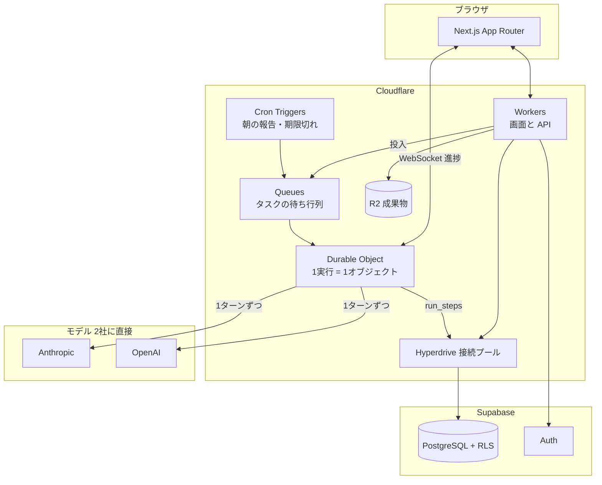

# 05 — 技術構成とコスト

> 2026-08-21 第3改訂。ホスティングを **Cloudflare** に確定。
> モデルは **Anthropic と OpenAI の2社に直接**。仲介と Managed Agents は使いません。

## 結論

| | 採用 | 見送り（後から足せる） |
|---|---|---|
| ホスティング・実行 | **Cloudflare**（Workers / Durable Objects / Queues / Cron / R2） | Vercel |
| DB・認証 | **Supabase**（Postgres ＋ RLS ＋ Auth） | Neon など |
| 成果物の保管 | **R2**（下り転送が無料） | Supabase Storage |
| モデル | **OpenRouter**（2026-08 に変更 → 下の判断ログ）| Anthropic 直 ＋ OpenAI 直（残してある） |
| エージェント実行 | **Messages API ＋ Tool Runner**（自前の1ループ） | Managed Agents |
| 道具 | **サーバー側ツール**（Web検索・Webフェッチ・コード実行） | 自前サンドボックス |

**3つとも「後から足せるもの」でした。だから最初は足しません。**

## 構成



## Cloudflare を採る

**採用します。** 決め手は値段ではなく、**実行の形が素直になる**ことです。

### 1実行 = 1 Durable Object

AI社員が1タスクをこなす間、状態を持つ場所が要ります。Durable Object はそれにそのまま使えます。

| DO がくれるもの | なぜ効くか |
|---|---|
| **1実行につき1つ、確実に1つだけ** | 二重起動が起きない。キューが同じジョブを2回配っても、掴むのは同じオブジェクト |
| **状態をメモリに持てる** | 会話履歴を毎ターン DB から読み直さなくていい |
| **WebSocket をそのまま張れる** | 進捗を画面へ直接押し出せる。DB を経由しない |
| **alarm で自分を起こせる** | 待ちが必要なとき（レート制限・再試行）にタイマーを持てる |

進捗の画面反映は **DO からの WebSocket** に寄せます。Supabase Realtime は使いません。
（`run_steps` は監査と再開のために DB へ書き続けます。画面への配信経路が変わるだけです。）

### 待っている時間が安い

Workers の課金は **CPU 時間**です。エージェントの実行は、ほとんどの時間が**モデルの応答待ち**で、
その間 CPU は動いていません。**この用途では有利な課金の形**です。

Durable Object は稼働時間（GB秒）でも課金されますが、含まれる **400,000 GB秒** は
1オブジェクト 128MB として **約 3,200,000 秒**。1 Work（13タスク × 約12分）で約 1,170 GB秒なので、
**含まれるぶんだけで月 300 Work 以上**。この規模では実質定額です。

| | |
|---|---|
| Workers 有料プラン | **$5/月**（1,000万リクエスト・3,000万 CPUミリ秒込み） |
| 超過 | 100万リクエスト $0.30 / 100万 CPUミリ秒 $0.02 |
| Durable Objects | 100万リクエスト・400,000 GB秒 が同じ $5 に含まれる |
| R2 | 成果物の保管。**下り転送が無料** |

### それでも「1ターンずつ書いて再開できる」形は崩さない

プラットフォームの実行時間の上限がいくつであっても困らないように、実行はこう組みます。

```
1. Queue がジョブを配る → Durable Object が掴む
2. Tool Runner を1ターン回すたびに run_steps を1件書く
3. 上限が近づいたら、そこで正常終了する（状態は run_steps に全部ある）
4. alarm か次のジョブが、run_steps の続きから再開する
```

**進捗を run_steps に書く設計はもともと必要でした**（画面表示と監査のため）。
それがそのまま「途中で切れても再開できる」をくれます。
この形にしておけば、**あとで Vercel に戻っても、実行の中身は変わりません。**

### 正直な注意点

1. **Next.js を Workers で動かすには OpenNext アダプタが要る。** 動きますが、ビルド手順が1枚増えます
2. **Node 互換の確認を最初にやる。** 使う SDK（Anthropic / OpenAI / AI SDK）はいずれも fetch ベースなので
   Workers で動く見込みは高いですが、**Phase 3 の 0番目のタスク**として先に確かめます
3. **Postgres は残します。** 多テナントの安全は行レベルセキュリティ（RLS）に賭けているので D1 には替えません。
   Workers から Postgres は **Hyperdrive** 経由で接続プールを解決します
4. **Supabase の役割が減ります。** Storage は R2 に、Realtime は DO の WebSocket に移るので、
   残るのは **Postgres ＋ Auth** です。将来もっと安い Postgres に替える余地が生まれます

固定費は **Workers $5 ＋ Supabase Pro $25 = $30/月**。

## モデルは OpenRouter を通す

> **2026-08 に変えました。** もとは「2社に直接つなぐ」でした。
> 下の節はそのときの理由で、**消さずに残しています** — そこに書いた懸念（委託先の開示・
> ガードレールの不揃い）は、通り道を変えても消えないからです。
> 覆した記録と、引き受けた宿題は **「判断ログ — OpenRouter を入れる」** に。

**Anthropic と OpenAI の両方に、直接つなぎます。OpenRouter などの仲介は挟みません。**

### なぜ仲介を挟まないか

OpenRouter 自体は良くできています（推論に上乗せなし、キャッシュも透過する）。
それでも挟まないのは、OneFound が**モデルの品揃えを必要としない**からです。使う階層は3つだけです。

| | 直接 | 仲介あり |
|---|---|---|
| プロンプトキャッシュ | 仕様どおり。**原価の見積もりが読める** | 透過するが間に1枚入る。外れたときの切り分けが増える |
| 手数料 | なし | クレジット購入時 5.5% |
| Batch / Flex（夜間の一括処理を割引） | 使える | 使えない |
| サーバー側ツール（Web検索・コード実行） | 使える | 一部制限 |
| データの学習利用 | 2社とも API は既定で不使用 | プロバイダごとに違う。設定で塞ぐ必要がある |
| 障害時の迂回 | **2社あるので自分で切り替えられる** | 自動 |

仲介の一番の利点は「障害時の自動迂回」でしたが、**2社に直接つないだ時点で、そこは自前で足ります。**

### 単価（100万トークンあたり）

| 階層 | 使う所 | Anthropic | OpenAI |
|---|---|---|---|
| `deep` | 統括AIの計画・最終判断 | **Opus 5** $5.00 / $25.00 | GPT-5.6 Sol $5.00 / $30.00 |
| `standard` | **成果物を作る工程** | **Sonnet 5** $3.00 / $15.00 | GPT-5.6 Terra $2.50 / $15.00 |
| `fast` | 読む・集める・要約・分類 | **Haiku 4.5** $1.00 / $5.00 | GPT-5.6 Luna $1.00 / $6.00 |

太字が現時点の既定です。**見ての通り、2社はほぼ同じ値段です。**

だから **OpenAI を足す理由は「安くするため」ではありません。** 3つあります。

1. **止まらないため。** 片方が落ちても、もう片方に切り替えて実行を続けられる
2. **選べるため。** 階層ごとに、実測して得意な方を当てる（今は分からないので、実測してから決める）
3. **夜間の割引。** 週次まとめのような急がない処理は Batch / Flex に流す

### プロンプトキャッシュは2社で作法が違う

| | Anthropic | OpenAI |
|---|---|---|
| 指定の仕方 | **明示的**にキャッシュ位置を置く | **自動**（同じ前置きなら勝手に効く） |
| 割引 | キャッシュ読みは通常入力の約 0.1 倍 | キャッシュ入力は通常の約 0.1 倍 |
| 効かせ方 | **どちらも「安定した前置きを先、揺れるものを後ろ」** | 同左 |

**プロンプトの並べ方（→ [02](./02-executive-model.md)）は両方に効きます。** 設計を変える必要はありません。

### `ModelProvider` を1枚挟む

```
AgentRunner
  └─ ModelProvider          ← ここで2社を吸収する
       ├─ AnthropicProvider  … キャッシュ位置を明示、サーバー側ツールあり
       └─ OpenAIProvider     … キャッシュは自動、道具の名前が違う
```

プロバイダごとに違うのは「キャッシュの指定」と「使える道具」だけです。
道具は `capabilities` で吸収します（[03](./03-agent-schema.md) のAI社員定義と同じ仕組み）。

**切り替えは設定値。** 階層ごとにどちらを使うかを表で持ち、コードは階層名しか知りません。

### 安いモデルは、順番を逆にしない

さらに安いモデルに寄せると 1 Work は $3.82 → $2.78 程度まで下がります。**差は約 $1（¥150）。**
Pro プランで月 ¥750〜1,050、粗利率にして5ポイントぶんです。実在しますが、初日に取りに行く額ではありません。

1. Phase 3 の最後に、**同じタスクを両社・複数階層で走らせて、成果物を並べて比べる**
2. 質が落ちないと確認できた階層だけ、安い方に寄せる

**先に安くして、あとで質を確かめる順番にはしません。逆にします。**

## Managed Agents をやめる理由

Anthropic 直に戻したので、Managed Agents はまた選べます。それでも使いません。
**必要な機能が、素の Messages API と自前の設計でほぼ埋まっている**からです。

| Managed Agents がくれるもの | OneFound での代わり |
|---|---|
| エージェントのループ | SDK の **Tool Runner** がループを回す。書くのはツールの中身だけ |
| サンドボックス（コード実行・Web検索） | **サーバー側ツール**として素のAPIで使える |
| 社員の記憶 | `employees` と Postgres に持つ。**自分のDBにある方が、画面に出すのも消すのも楽** |
| 委譲・並列 | 統括AIのタスクグラフがそれ。**受け渡しの可視化が製品そのもの**なので、外に出したくない |
| セッションの予算上限 | 応答に含まれる使用量から自分で計測する |
| 定期実行 | Cloudflare Cron Triggers |
| 設定の版管理 | `agent_definitions` に版を持つ（[03](./03-agent-schema.md)） |

残るのは「beta の仕様変更に振り回されない」という利点だけです。
`AgentRunner` の実装をもう1つ足せばいつでも戻れるので、**必要になってから戻します。**

## 判断ログ — OpenRouter を入れるか（2026年8月・結論: いまは入れない）

3つの軸で見て、**いまは入れない**。ただし恒久ではなく、条件を決めて先送りする。

### ① 価格 — 入れる価値はある。効くのは規模が出てから

| | 入力 /1M | 出力 /1M |
|---|---|---|
| Haiku 4.5（いまの `fast`） | $1.00 | $5.00 |
| Gemini 2.5 Flash-Lite | $0.10 | $0.40 |
| DeepSeek V4-Flash | $0.14 | $0.28 |

`fast` は**入力が多く出力が少ない**工程なので、ここを1/10の価格帯に替えると
**1 Work $3.82 → $2.2 前後（約4割減）**の見込み。

**ただしこの見積りは未実測。** `run_steps` の `tokens_in / tokens_out` を工程ごとに
記録する設計になっているので、Phase 3 で動かせば実数が出る。**測ってから決める。**

節約はユーザー数に比例して増えるが（100人で約 $800/月、1,000人で約 $8,000/月）、
下の②③のコストは**最初に全部かかる**。

### ② 管理 — いま入れると負債

- **委託先の開示**。OpenRouter は裏で多数のプロバイダにルーティングする。
  プライバシーポリシーに書く委託先が「今日どこへ流れたか」で変わる状態は説明できない。
  ログ保存・学習利用のポリシーもプロバイダごとに違う
- クレジット前払いの残高監視、モデルIDの廃止・移動への追従、エラー形式が2系統になる
- 手数料自体は障害にならない。**BYOK は月100万リクエスト（または定価 $25,000 相当）まで無料**、
  超過分5%。クレジット購入は5.5%（最低 $0.80）。自前キーのある2社は当面ゼロ

### ③ 悪用への耐性 — OpenRouter は**むしろ不利**

| | |
|---|---|
| **不利** | 安いモデルほどガードレールが弱い。Anthropic / OpenAI のモデルが**自分で断る**のは無料でついてくる安全層で、そこを外すことになる |
| **不利** | 規約違反は**契約者であるこちらに集計される**。間に会社が挟まるぶん、止まったときの復旧交渉が遠い |
| **不利** | モデルごとに断る基準が違うと挙動が揃わない。**制御できないポリシーは、厳しさより不揃いさの方が害** |
| 有利 | 片方が止まっても製品全体が死なない冗長性（ただしこれは可用性の話で、悪用対策ではない） |

**悪用対策をモデル提供者に依存しない。** OneFound の防波堤は自前側にある。

1. **統括AIが入口** — すべての依頼が通る一点でポリシー判定する
2. **道具を社長に触らせない**（→ [03](./03-agent-schema.md)）
3. **外部への副作用は人間ゲート**（→ [02](./02-executive-model.md)）
4. **監査ログ** — `audit_events` に全遷移が1行残る

モデルの拒否は**おまけ**。扱うモデルが少ないほど挙動が揃い、責任範囲を説明しやすい。

### 決めたこと

- **Phase 3 では入れない。** `fast / standard / deep` の抽象と provider adapter だけ作る
- 入れるときは **`fast` だけ**。`standard` と `deep` は Anthropic / OpenAI 直のまま
  （`fast` は成果物を書かず、副作用のある道具も持たないので③の懸念がほぼかからない）
- 差し替えを再検討する条件（どれか1つ）
  1. 実測で `fast` 層が原価の35%を超えた
  2. 原価率（API原価 ÷ 売上）が30%を超えた
  3. 2社にない安いモデルが必要になった（長文読みなど）
  4. プロバイダ障害で実際に止まった

追加は実質1日で済む形にしておくので、**この決定はいつでも覆せる。**

## 判断ログ — OpenRouter を入れる（2026年8月・**上の決定を覆した**）

社長の判断で **OpenRouter を通り道にする**。上の節は消さずに残す —
「なぜ最初は入れなかったか」は、いま抱えている宿題そのものだから。

### 何が変わったか

| | 前 | いま |
|---|---|---|
| 通り道 | Anthropic 直 ＋ OpenAI 直 | **OpenRouter**（`lib/ai/openrouter.ts`） |
| モデルの名前 | `claude-opus-5` | `openai/gpt-5.6-luna`（`TIER_TABLE.model`。2026-08-24 に変更 → 下の判断ログ） |
| 直つなぎ | 既定 | **残してある**（`TIER_TABLE.direct` と `vendor` の書き換えだけで戻る） |
| 鍵 | `ANTHROPIC_API_KEY` | `OPENROUTER_API_KEY` |

3階層とも OpenRouter に通す。上の節の「入れるときは `fast` だけ」からも外れているが、
**通り道を2本持つほうが、切り分けも説明も難しくなる**ので揃えた。

### 引き受けた宿題（上の②③は消えていない）

1. **委託先の開示。** OpenRouter は裏で複数のプロバイダにルーティングする。
   プライバシーポリシーに書く委託先が「今日どこへ流れたか」で変わる。
   → **`provider` の指定でルーティングを固定する**（`only` / `order`）。
   固定しないまま公開しない。**Phase 11（課金と公開）までに決める。**
2. **ガードレールの不揃い。** モデルごとに断る基準が違うと挙動が揃わない。
   → いまは3階層とも同じモデル（GPT-5.6 Luna）なのでずれない。
   階層ごとに別のモデルを当てるときに、あらためて考える。
3. **キャッシュとエラー形式。** 上の表の「間に1枚入る」はそのまま残る。
   Anthropic 直のときに書いていた `cache_control` は、いまの実装では渡していない。

### この環境から確かめられていないこと

**`openrouter.ai` に出られない**（egress で塞がれている）ので、
ドキュメントに当たれていない。鍵が入ったら**最初にこの3つ**を確かめる。

1. ~~**モデルの slug。**~~ → **確かめた**（2026-08-24）。`GET /api/v1/models` に
   `openai/gpt-5.6-luna` が実在し、**tools 対応**（統括AIは1往復で道具を5つ呼ぶので絶対条件）／
   コンテキスト 105万 ／ `reasoning_effort` は max・xhigh・high・medium・low・none の6段
2. **プロンプトキャッシュが透過するか。** 透過するなら `cache_control` の渡し方
3. **`usage` に何が入るか。** キャッシュの読み書き量が取れないと、原価が読めない

**単価（`TIER_TABLE`）は OpenRouter の実測値**（$0.2 / $1.2 per M。2026-08-24 に一覧で確認）。
27万トークンを超えると $0.4 / $1.8 に上がるが、こちらの依頼文はその桁に届かない。
OpenRouter は推論に上乗せしないが、クレジット購入時に 5.5%、BYOK は
月100万リクエストまで無料・超過分5%。**原価を出すときは手数料を別に足す。**

### 判断ログ（2026-08-24）— モデルを GPT-5.6 Luna にした

**社長の判断: 返事が遅いので、モデルを OpenAI: GPT-5.6 Luna に変える。**

遅さの正体は**モデルではなく `modelFor()` の既定**だった。
「本番以外は自動で無料の Ox Alpha」になっていたので、表を書き換えても本番以外には効かず、
**社長が選んだモデルで動いていなかった**（Ox Alpha の実測は p50 5秒・p90 35秒・p99 96秒）。

- `TIER_TABLE` の3階層とも `openai/gpt-5.6-luna`。単価も実測値に差し替えた
- **無料のテストモデルは既定から外し**、`OPENROUTER_FREE_TEST=1` のときだけにした
- **3階層が同じモデルなのは、階層の設計を捨てたのではない。**
  「深さ＝thinking の量。モデルは変わらない」を素直に表した形で、
  違いは `reasoning_effort` で付く（fast / standard は low、統括AIの計画は high）
- 引き受けた宿題: **統括AIの計画（deep）も Luna になった。**
  Luna は速さと安さのモデルなので、計画の質は前より落ちうる。
  質が要るなら `openai/gpt-5.6-luna-pro`（同じ単価・`reasoning.mode=pro`）に
  deep だけ差し替えられる — 表の1行で戻せる

## 1 Work あたりの原価

前提: 4フェーズ / 13タスク / AI社員3体、$1 = ¥150、プロンプトキャッシュ込み。

| 内訳 | | 金額 |
|---|---|---|
| AI社員 1タスク | 集める(fast) → 作る(standard) の2工程 | $0.23 |
| × 13タスク | | $2.99 |
| 統括AI | 計画1回(deep) ＋ 監視15回(うち12回 fast) | $0.83 |
| **1 Work 合計** | **≈ ¥573** | **$3.82** |

| 使い方 | API原価 |
|---|---|
| 月3 Work | $11（¥1,700） |
| 月5 Work | $19（¥2,900） |
| 月10 Work | $38（¥5,700） |

固定費: Workers $5 ＋ Supabase Pro $25 = **$30/月**（顧客数で割る）

## トークンの定義

呼び方を「クレジット」から **「トークン」** に変えます。

> **1トークン = $0.00001**（10万トークンで $1）

| | トークン |
|---|---|
| AI社員 1タスク | 約 **20,000** |
| 1 Work（13タスク＋統括AI） | 約 **350,000** |
| Pro プランの月枠 | **2,000,000** |

### トークンは、ふだんの画面に出さない

**社長にトークンを数えさせない。** 左レールの残高、進捗の消費グラフ、採用の想定トークン、
計画のフェーズ別見積り — **全部やめました**。数字を見て仕事を選ぶ製品にしない。

出すのは次の2か所だけ。

| どこ | 何を出すか |
|---|---|
| 請求・プラン画面 | 今月の使用量と枠（`412,000 / 2,000,000`）。見に行った人だけが見る |
| 枠に当たったとき | 止まった理由として初めて出す。「今月の枠を使い切りました」＋何をすれば続くか |

**正直に書いておくこと**: これはモデルの実トークン数ではありません。
使うモデルによって1トークンの重みが違うので、**原価を揃えた OneFound 共通の単位**です。
請求画面にだけ「1トークン ≒ AIの処理の最小単位。実際の消費はモデルによって変わります」と添えます。

内部は**セント単位の整数**で持ち、表示のときだけ `token_rate` で直します。浮動小数を通しません。

| 上限をかける場所 | |
|---|---|
| 会社の月枠 | `accounts.token_balance`。0 で新規実行を止める |
| Work ごと | `works.budget_tokens` |
| 1実行ごと | Durable Object が使用量を積算し、超えたら一時停止（再開可） |
| 用事1件ごと | 30,000トークン。超えそうなら Work への昇格を提案（→ [06](./06-work-and-scope.md)） |

## 無料枠をどうするか

**「Free プラン」は作りません。代わりに「7日トライアル」＋「閲覧だけは永久に無料」にします。**

```
登録（カード不要）
  → 7日間 / 200,000トークン
     （最初のフェーズを完走して、成果物を1つ受け取れる量）
  → 期限切れ or 使い切り
  → 「閲覧のみ」に自動で落ちる（永久・無料）
     作ったものは全部見られる。新しい実行だけ止まる
```

> **なぜ「1 Work 完走」ではなく「最初のフェーズ」なのか。**
> Work は4フェーズで10週かかる想定なので、7日では終わりません。
> トライアルで見せるべきは全体の完成ではなく、**「AI社員が実際に働いて、成果物が出てくる」瞬間**です。
> 調査フェーズ1つ（約80,000トークン）＋統括AI で足ります。200,000 は余裕を見た数字です。

### なぜ「Free プラン」にしないか

1. **この製品は原価が変動費です。** 普通のSaaSの無料枠は限界費用がほぼゼロですが、
   OneFound は無料ユーザー1人あたり毎月 $2〜4 が出続けます。居座られると効きます
2. **成果物が出るところまで見せないと価値が伝わりません。** 途中で切れると
   「AIが微妙だった」という印象だけ残って離脱します。**絞るより、一番良い体験を1回**
3. **期限があると人は決めます。** 無期限の無料枠は、判断を先延ばしにさせるだけです。
   7日は短いようですが、**最初の成果物は初日か2日目に出ます**。迷う時間としては十分です

### なぜ「閲覧のみ」を永久に無料で残すか

- **原価がゼロ**（実行しないので）。ストレージ代だけ
- 作った成果物と決定事項が消えないので、**戻ってくる理由が残る**
- 「無料プランがある」と言える（実態は違いますが、嘘でもない）

不正対策: メール確認必須、1アカウント1回、同一決済手段での再取得を弾く。

## 料金プラン

年払いは月換算で 22〜25% 引き。

| プラン | 月払い | 年払い（月換算） | トークン / 月 | API原価 | Work の目安 |
|---|---|---|---|---|---|
| **トライアル** | ¥0 | — | 200,000 / 7日 | $2 | 最初のフェーズ |
| **閲覧のみ** | ¥0 | ¥0 | — | $0 | 実行できない |
| **Starter** | ¥3,980 | **¥2,980** | **800,000** | $8 | 月 2本 |
| **Pro** ⭐ | ¥8,980 | **¥6,980** | **2,000,000** | $20 | 月 5本 |
| **Business** | ¥19,800 | **¥14,800** | **4,000,000** | $40 | 月 10本 |

粗利（API原価のみ・固定費別）:

| | 月払い | 年払い |
|---|---|---|
| Starter | 70% | 60% |
| Pro | 67% | 57% |
| Business | 70% | 59% |

固定費 $30/月は **Starter 2社で回収**できます。

### プラン間の差

**トークンだけで差をつけません。** トークンだけだと「安いプランで足りる」に流れ、
足りなくなったら追加購入するだけになります。**追加購入は全プランで開けたまま**にして、
上のプランに行く理由は別に置きます。

| | 閲覧のみ | Starter | Pro ⭐ | Business |
|---|---|---|---|---|
| **トークン / 月** | — | 800,000 | 2,000,000 | 4,000,000 |
| **同時に進行できる Work** | — | **2** | **5** | 無制限 |
| **採用できるAI社員** | — | **3** | **10** | 無制限 |
| **AI社員を自分で作る** | — | — | ○ | ○ |
| **外部連携**（Slack / Notion / Drive） | — | — | ○ | ○ |
| **成果物・Work の共有リンク** | — | ○ | ○ | ○ |
| **パスワード・有効期限つき共有** | — | — | ○ | ○ |
| 成果物・決定事項の閲覧 | ○ | ○ | ○ | ○ |
| 混雑時の優先実行 | — | — | — | ○ |
| サポート | — | メール | 優先メール | 個別 |

差の付け方の考え方:

- **成果物の質でプランを分けない。** 安いプランに弱いモデルを当てると、
  一番口コミが要る層の体験が落ちます。**全プラン同じ品質**にします
- **同時Work数**が一番効く軸です。**同じ事業**の中で2本目を回すなら Pro。
  **別の事業なら会社を分ける**（→ 判断ログ）
- **AI社員を自分で作れる**を Pro 以上にします。ここが「AIカンパニーを自分で設計する」の入口で、
  この製品の性格そのものなので、有料の芯に置きます
- **保存期間で人質を取らない。** 作ったものは無料に落ちても見られます
- **閲覧メンバーの招待はやめました**（→ 判断ログ）。一人社長が見せたい相手は「見る人」ではなく
  「結果を受け取る人」です。**共有リンク**のほうが軽く、リンク自体が宣伝にもなります
- **Business の行が1つ減りますが、埋めません。** 行を埋めるために機能は作らない

追加トークン: **500,000 トークン ¥2,500**（原価 $5・粗利 67%）。全プランで購入可。

## 判断ログ — 1ユーザーが複数の会社を持てるようにするか（2026年8月・結論: する。ただし Phase 11）

### いまの形

**会社（`accounts`）はもう分離されている。** 全27表の RLS が
`account_id = private.current_account_id()` の一形だけでできていて、
**列を直接読んでいるポリシーが1つもない。**

なので複数社に開くとき書き換えるのは、`current_account_id()` の中身と、
切り替えの画面だけ。**ポリシー本体は1行も触らない。**
だから急がない。**課金と一緒に Phase 11 で入れる。**

### 分けることに、ユーザー側の意味があるか — ある（3つ）

1. **決定事項が混ざらない。** 決定事項は「なぜその道を選んだか」の台帳です。
   事業が違えば前提が違う。混ざると、統括AIが別の事業の前提で提案しはじめます
2. **口調とスキルが事業ごとに持てる。** 会社共通の SKILL.md とルールは会社単位。
   日本語学習サービスの書き方を、整体院の記事に持ち込まれても困ります
3. **たたむ・売る・人に渡すが、会社ごとにできる。** 1つの `account` を丸ごと譲渡・削除できます

### 料金 — 1社目も2社目も同じ価格。月払い / 年払いは会社ごとに選ぶ

会社が増えるほど売上は素直に増えます。**2社目割引はしません。**
分ける側にすでにコストがあるので（次節）、値引きで背中を押す必要がない。

### 取り消し — 「Starter を2つ買われる」は成り立たない

以前この検討で「Starter の同時Work が2本だから、2事業目のとき Pro に上がらず
Starter をもう1つ買うのが合理的になる。月 ¥1,020 の取りこぼし」と書きました。
**これは間違いです。**

Starter×2 と Pro×1 は、同じものの安い版ではありません。会社を分けると、

- **顧客情報・成果物・決定事項を持ち越せない**
- **AI社員を採用し直して、もう一度教える**（スキルとルールを書き直す）
- 両方を一度には見られない（ホームは会社単位）

つまり**分けること自体にコストがあります。**
同じ事業の中で2本目の Work を回したいなら Pro に上がる。別事業なら分ける。
**この2つは代替品ではありません。**

→ **Starter の同時Work は 2本のまま。** 下げる必要はありませんでした。

### 料金ページに、分けると何を失うかを書く

隠すと「2社目を作ったのに何も引き継がれない」と後で言われます。先に書きます。

> 会社を分けると、顧客情報・成果物・決定事項は引き継がれません。
> AI社員も採用し直しになります。
> 同じ事業の中で仕事を増やすだけなら、プランを上げるほうが得です。

### 画面 — 上は「どの会社にいるか」、下は「わたし」

- **レール上部＝会社の切り替えだけ。** 会社名 ＋ ⌄。会社の一覧と「会社を追加」しか出さない
- **左下のアバター＝わたし。** 設定 / 請求 / ログアウト
- **混ぜない。** 会社の話と自分の話を同じメニューに入れると、どちらを押すか毎回考えることになります

### 決め直し — ⌄ は最初から出す。だから複数社は前倒しする

会社が1つでも `⌄` を出します。中身は**会社の一覧 ＋ 会社を追加**。

**押せるようにする以上、複数社は本物にします。** 前に書いた「先に表を足さない」は撤回します。
理由（誰も通らない表になる）が、UI が使う時点で消えるためです。
Phase 11 まで待たず、**認証まわりを作るときに一緒に**入れます。

| やること | 量 |
|---|---|
| `memberships`（user × account × role） | 表1つ |
| `private.current_account_id()` の書き換え | 関数1つ。**ポリシー28本は触らない** |
| `users.account_id` → 「いま見ている会社」 | 意味の変更のみ |
| 会社を追加のフロー | 名前を聞いて `accounts` と `memberships` を1行ずつ |

合わせて半日ぶんです。

**トライアル枠は人に1回。2社目からは有料。**
いまは `handle_new_user()` が会社を作るたびに $5 を配るので、
このままだと**会社を作り直すだけで枠が湧きます。** 枠は `accounts` ではなく人に紐づけます。
料金は前の決定どおり、1社目も2社目も同じ価格（月払い / 年払いは会社ごと）。

### 構造は、もう複数社に耐えます — だから先に表を足さない

**1対1を仮定しているのは `users.account_id` の1列だけ**です。データはユーザーではなく
**会社（`accounts`）にぶら下がっています。**

```
auth.users ──1:1── users ──N:1── accounts ──1:N── 25表
                     └ account_id            全部 account_id ＋ RLS
                       ここだけが「1人1社」
```

| 確認したこと | 結果 |
|---|---|
| ユーザーを参照している列 | **`users.id → auth.users(id)` の1本だけ**。業務データにユーザーへの外部キーはない |
| `account_id` を持たない表 | `accounts` 本体と中間表3つ（親をたどって絞るので不要） |
| RLS ポリシー28本 | すべて `account_id = private.current_account_id()`。列を直接読むものはゼロ |
| 課金・残高 | `accounts.plan` / `token_ledger.account_id`。**もう会社ごと** |

Phase 11 で変わるのは `users.account_id` の左側だけで、`accounts` の右側は動きません。

**いま `memberships` を先に置くのはやりません。** 1人1行しか入らない表ができて、
どのコードもそこを通らない。**テストされない構造は構造ではありません。**
有効にした瞬間に「ここも1社前提だった」が出ます。表を足すのは、切り替えを作る日と同じ日に。

代わりにいま効くのはルールです。

1. **アプリコードから `users.account_id` を直接読まない。** 必ず `private.current_account_id()` 経由
2. **「この会社のユーザーは自分だけ」を前提にしたコードを書かない**
3. **会社の名前を入口で聞く。** いまはメールアドレスがそのまま会社名になる（`handle_new_user`）。
   これが後で切り替えのラベルになる

スキーマに残すのは、意味を取り違えないための注釈1行だけ（`0004_notes.sql`）。

### 待つことの唯一のコスト

技術的負債ではありません。**2つの事業を1つの会社に混ぜてしまったユーザー**です。
あとで分けるには `works` から辿れる行の `account_id` を移す必要があり、
両方にまたがった決定事項とチャットはきれいには割れません。

Phase 11 は課金のフェーズなので、それより前にいるのはトライアル層だけです。
**露出する期間は短い。** それでも、混ざっているのを見つけたら早めに声をかけます。

### 閲覧メンバーの招待 — 作らない

料金表から外しました。理由は、一人社長が見せたい相手が「見る人」ではないからです。

| 相手 | ほしいもの | 「閲覧メンバー」で足りるか |
|---|---|---|
| クライアント | **この成果物**を見たい | 過剰。アカウントを作らせる話ではない |
| 税理士 | 数字だけ | 別物（請求画面） |
| 業務委託・共同創業者 | **やりたい**（見るだけでは足りない） | 足りない |

**統括AIとのチャットは人に見せる場所ではありません。** 迷いと却下した案が並ぶところです。
招待を作ると「viewer は何を見られるか」を全画面ぶん決めることになります。

**代わりに共有リンク。** 成果物1件、または Work 1つの状況を、署名付きの読み取り専用URLで渡す。
権限モデルもシート数えも `memberships` も要りません。作ったものが外に出るので、
**リンク自体が宣伝**にもなります。

これで「招待が `memberships` を強制する」も消えました。複数社を先に作る理由は、
**観測（同じ人が2社目を欲しがっている）だけ**になります。

### Phase 11 で変わるところ

- `memberships`（`user_id` × `account_id`）を足す。`users.account_id` は
  「最後に見ていた会社」に降格する
- `private.current_account_id()` は memberships と「いま選んでいる会社」から引く
- 課金は account 単位（`accounts.plan` はもともと account 側にある）
- **RLS のポリシーは書き換えない**

## 判断ログ — Vercel か Cloudflare か（2026年8月・結論: Cloudflare のまま）

Phase 4 の途中で「ユーザーが増えたときのことも考えて、どっちがいいか」ともう一度聞かれたので、
値段だけでなく**増えたときに何が起きるか**で見直しました。結論は変わりません。

### 値段は決め手にならない

月300 Work（1 Work ≈ 3.8ドル）を回している状態で並べます。

| | Vercel | Cloudflare |
|---|---|---|
| モデルAPI | $1,150 | $1,150 |
| ホスティング | $20〜150 | $5〜30 |
| Postgres | $25 | $25 |

**ホスティングは原価の1割にも届きません。** どちらを選んでも請求書はモデル代で決まります。
つまりここは「安いほう」ではなく「**形が素直なほう**」で選ぶ場面です。

### 増えたときに効くのは、この3つ

1. **待っている時間の課金。** AI社員の実行は、ほとんどが「モデルの返事待ち」です。
   Workers は **CPU 時間**で課金するので、待っている間はほぼ0。
   Vercel の Fluid compute も待ち時間を圧縮しますが、**時間ベース**なので、
   同じ待ちでも料金が積み上がります。実行が長いほど差が開きます
2. **1実行 = 1オブジェクト。** Durable Object は「1つのAI社員の実行」に状態と WebSocket を
   まとめて持てます。Vercel だと同じことをするのに Redis なり Postgres の
   ポーリングなりを別に足すことになり、**部品が増えます**
3. **業者の数。** Cloudflare なら Workers / DO / Queues / R2 が1社に収まり、
   残りは Supabase（Postgres ＋ Auth）だけ。増えたときに見る請求書とダッシュボードが少ないほど、
   一人でやるには楽です

### Vercel が勝っているところ（正直に）

- **ビルドが一手少ない。** OpenNext のアダプタが要らない
- **Next.js の新機能に先に対応する。** 本家なので当然です
- **プレビューURLとダッシュボードが親切。** ここは実際に使っていて差を感じました

いずれも「開発中の気持ちよさ」で、**運用に入ってからの構造には効きません**。

### 速さの差はどこに出るか（2026年8月・実測）

**アニメーションと触り心地に差は出ません。** 動きは全部ブラウザの中で起きていて、
サーバーは1ミリも関わりません。実際、ブラウザに届く JS と CSS は
`next build` と Cloudflare 向けビルドで**1バイトも違いません**（md5 が一致）。

    next build      c4ceb3464b9b1e4aa19dd006d4b39135
    cloudflare向け  c4ceb3464b9b1e4aa19dd006d4b39135

サーバー側も、同じビルドを workerd（Cloudflare の実行環境）と Node で並べると
1回あたり **7〜10ms** しか違いません。

    最初のバイトが返るまで（3回ずつ）
      /home          workerd 0.054 / 0.045 / 0.044     node 0.040 / 0.038 / 0.060
      /tasks         workerd 0.020 / 0.018 / 0.022     node 0.013 / 0.011 / 0.013
      /deliverables  workerd 0.023 / 0.017 / 0.017     node 0.013 / 0.009 / 0.012

**効くのは処理の速さではなく「どこで動くか」です。**

| | Cloudflare | Vercel |
|---|---|---|
| 動く場所 | 使う人のいちばん近く（300か所以上） | 選んだ1つのリージョン |
| 立ち上がり | ほぼ0（isolate） | Node の関数は待ちがある（Fluid で縮むが0にはならない） |
| 東京のユーザー | 東京の拠点 | `hnd1` を選べば同じ。**既定の `iad1`（米東）のままだと往復 +150ms** |

Vercel でリージョンを間違えたときの +150ms は、ここまで削ってきた
「押してから反応するまで」（10〜40ms）を丸ごと打ち消す大きさです。

### ただし Cloudflare には逆の落とし穴がある — Supabase は東京にある

Cloudflare は**使う人の近く**でコードを動かします。Supabase（`ap-northeast-1`）は東京固定です。
海外から使われると、Worker はその土地で動き、そこから東京の Postgres に問い合わせることになります。
**近くで動くことが裏目に出ます。**

- いまは全部ダミーで DB を触らないので、影響はゼロ
- **Phase 5 で本物のデータを読み始めたら**、`wrangler.jsonc` に
  `"placement": { "mode": "smart" }` を足す。Cloudflare が「この Worker は東京の DB を
  よく叩く」と判断して、実行場所を DB の近くへ寄せます
- 逆に言うと、**Phase 5 に入るまでは足しても何も起きません**（判断材料が無い）

### 逃げ道はある

`app/ lib/ components/ middleware.ts` を検索して、**Cloudflare 固有のコードは0件**です。
アプリは素の Next.js のままで、Cloudflare は `wrangler.jsonc` と OpenNext のビルドだけで載っています。
DO と Queues を使い始める Phase 7 からは固定費が上がるので、
**戻すなら Phase 7 の前**。それ以降は移すコストが実装に食い込みます。

### 決めたこと

- **Cloudflare で進める**（Phase 4 の時点で workerd 上で全画面が動くことを確認済み）
- 本番 Worker は `onefound`、レビュー用は `onefound-preview` の2本立て
- **ダミーデータ表示（`DEMO_MODE`）は preview 側の env にだけ置く**。
  `.env*` に書くと OpenNext が既定値としてビルド成果物に焼き込み、本番にも付いていく。
  紛れ込んだときのために `APP_ENV=production` では効かないようにもしてある
- Phase 7 に入る直前に、DO と Queues の実測でもう一度だけ確かめる

## セキュリティ

- **RLS を全テーブルに。** サービスロールキーは実行オブジェクトだけが持つ
- **Anthropic も OpenAI も、API のデータを既定で学習に使いません。** これを利用規約に明記します
- **秘密情報は社員の記憶に書かない。** 保管庫に置き、実行時にだけ注入する
- **成果物は R2 に置き、署名URLで配る。** 公開バケットを作らない
- 監査は `audit_events` と `decision_refs`

## 実装で作る範囲

> フェーズの区切りと番号は [../PLAN.md](../PLAN.md) が正。ここは同じ仕事を作業順に並べたもの。

0. **Workers 上で SDK が動くことの確認**（ここで詰まると全部止まるので最初にやる）
1. スキーマと RLS、認証、レール＋ホームの器
2. Work 作成 → 統括AIが計画 → 承認 の一本道
3. AI社員1体で1タスクを最後まで実行。run_steps を Realtime で画面へ
4. 成果物の保存・レビュー・承認
5. 判断待ち → 決定 → 後続タスク解放
6. トークンの計上と上限、トライアルから「閲覧のみ」への自動降格
7. 社員を3体に増やし、受け渡しをホームのフロー図に出す
8. **モデルの実測。** 同じタスクを両社・複数階層で走らせ、質を見てから寄せる先を決める
